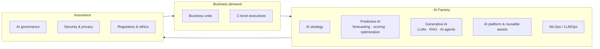

# Head of AI Factory — Role Pack

Complete package for the **Head of AI Factory** role: role spec, strategy & roadmap, governance/MLOps, interview kit, and a presentation deck.

| File | Purpose |
|------|---------|
| [README.md](README.md) | Role spec, mandate, requirements (this file) |
| [strategy-and-roadmap.md](strategy-and-roadmap.md) | AI strategy, operating model, org, 90-day plan, KPIs |
| [governance-mlops.md](governance-mlops.md) | AI governance, responsible AI, MLOps/LLMOps lifecycle |
| [interview-kit.md](interview-kit.md) | Interview questions + scorecard for hiring panel |
| [cv-cover-letter.md](cv-cover-letter.md) | CV outline + cover letter template for candidates |
| [job-skills-adaptation.md](job-skills-adaptation.md) | Job skills maps + adaptation (OCB, VPBank, Techcombank, NAB, Anthropic) |
| [zero-to-ai-expert-syllabus.md](zero-to-ai-expert-syllabus.md) | **Zero Python → AI expert** — 12-month syllabus & weekly plan |
| [learning-lab-guide.md](learning-lab-guide.md) | **Materials, exercises, how to learn** — start here for hands-on |
| [reading-path.md](reading-path.md) | **Step-by-step books & reading order** — what to read when |
| [anthropic-career-adaptation.md](anthropic-career-adaptation.md) | **Anthropic (Claude)** — 3 roles × 52-week syllabus map + CV |
| [anthropic_theme.py](anthropic_theme.py) | **Anthropic brand theme (PPTX)** — colors, fonts, slide helpers |
| [anthropic_docx.py](anthropic_docx.py) | **Anthropic brand theme (DOCX)** — Word styles, cover, fields, tables |
| [career-learning-mindmap.md](career-learning-mindmap.md) | **Mindmap** — learning path, VN banks, Anthropic stretch |
| [ai-skills-catalog.md](ai-skills-catalog.md) | **19 AI skills** — definition, books, practice, exercise (summary) |
| [ai-skills-workbook.md](ai-skills-workbook.md) | **Workbook** — links, steps, answers per skill |
| [project-adaptation.md](project-adaptation.md) | **Understand app + adapt** — BRD app map, learning bridge |
| [learning_data.py](learning_data.py) | **Single source of truth** — 52 weeks, 14 skills, links |
| [learning-data.json](learning-data.json) | Exported JSON (auto-generated) |
| [learning-lab/WEEKS.md](learning-lab/WEEKS.md) | 52-week index table |
| [learning-lab/](learning-lab/) | Runnable Week 1–2 exercises + sample data |
| `exports/Head-of-AI-Factory-Slides.pptx` | Presentation deck (generated) |
| `exports/Zero-to-AI-Expert-Roadmap-Slides.pptx` | Learning roadmap deck (generated) |
| `exports/Learning-Master-Slides.pptx` | **52-week master** — click W## to jump · resource links |
| `exports/AI-Skills-Learning-Slides.pptx` | **14 skills** — detail deck (from learning_data.py) |
| `exports/AI-Skills-Visual-Slides.pptx` | **Visual journey** — phases, loop, portfolio flow |

Generate everything from one data source:

```bash
python3 ai-factory/generate_all_learning.py
python3 ai-factory/scaffold_learning_lab.py   # week exercise stubs only
python3 scripts/generate_office_files.py    # FE Credit corporate decks
```

---

## Short description

The **Head of AI Factory** shapes and executes the organization's data science and AI strategy. The role leads development and deployment of advanced analytics, machine learning, and data-driven solutions that enable smarter decisions, improve risk management, and enhance customer experience. The Head of AI Factory is a trusted advisor to senior executives and drives a culture of innovation and data-driven decision-making.

---

## Mandate & scope



The role owns the **end-to-end AI value chain**: strategy → use-case intake → model build → platform → deployment → monitored business value, under an enterprise governance and responsible-AI framework.

---

## Areas of responsibility

| # | Responsibility |
|---|----------------|
| 1 | Define and execute the **enterprise-wide Data Science & AI strategy** aligned with business priorities |
| 2 | **Advise C-level executives** on AI-driven growth, efficiency, and risk management opportunities |
| 3 | Lead development and deployment of **Predictive AI and Generative AI** solutions (forecasting, scoring, optimization, LLMs, RAG, AI agents) |
| 4 | Define **AI architecture and delivery** approaches; oversee **MLOps/LLMOps** and model lifecycle |
| 5 | Develop and manage **enterprise AI platforms**, reusable assets, scalable AI/ML infrastructure |
| 6 | Partner with **IT and Data Architecture** to drive AI innovation and adoption of emerging tech |
| 7 | Establish **AI governance frameworks**; ensure compliance with security, privacy, regulatory, ethical standards |
| 8 | Collaborate with business units to identify use cases, **define value, assess ROI, measure outcomes** |
| 9 | Lead **workforce planning, talent development, performance management**, capability building |
| 10 | Promote **culture, values, leadership standards**; develop future AI leaders |

---

## Requirements

**Education**
- Master's or Ph.D. in Data Science, Computer Science, Statistics, Mathematics, or related field.

**Experience**
- 10+ years in data science / advanced analytics, including **5+ years in a leadership role**.
- Proven track record building and deploying ML and AI models in **large-scale production environments**.

**Technical expertise**
- Statistical modeling, machine learning, deep learning, NLP, and big-data technologies.
- Programming: **Python, R, SQL**; distributed computing: **Spark, Hadoop**; cloud: **AWS, GCP, Azure**.

**Leadership**
- Strong leadership, stakeholder management, and communication — able to **influence at executive level**.

---

## Success in the first year (outcomes)

| Horizon | Outcome |
|---------|---------|
| 90 days | AI strategy ratified; use-case portfolio prioritized; platform & governance baseline defined |
| 6 months | 2–3 high-value models in production; MLOps/LLMOps pipeline live; responsible-AI policy approved |
| 12 months | Measurable ROI on flagship use cases; reusable asset library; scaled AI talent and operating model |
