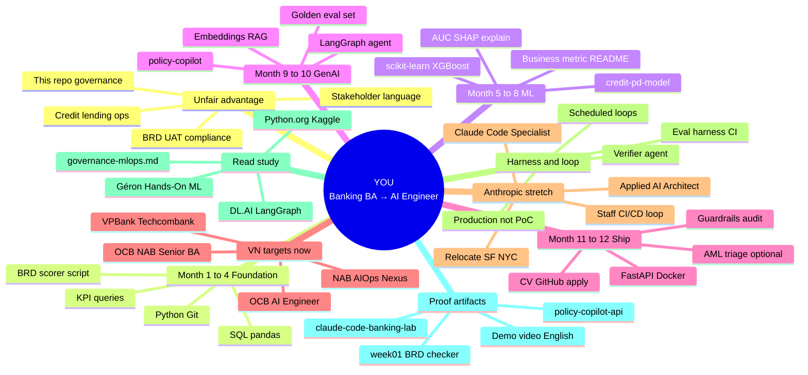
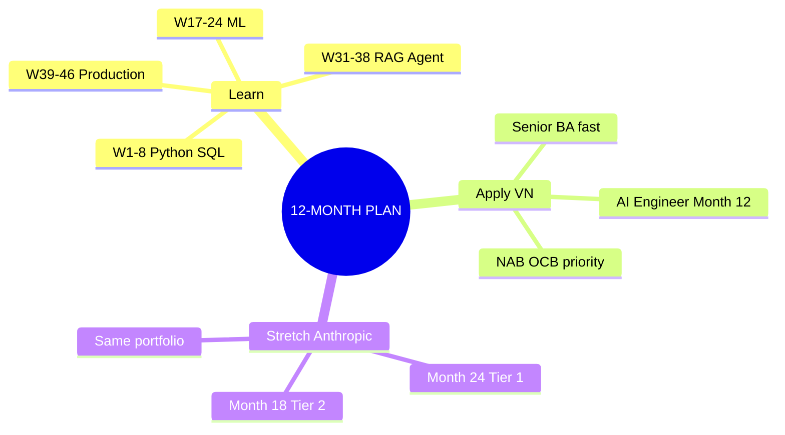
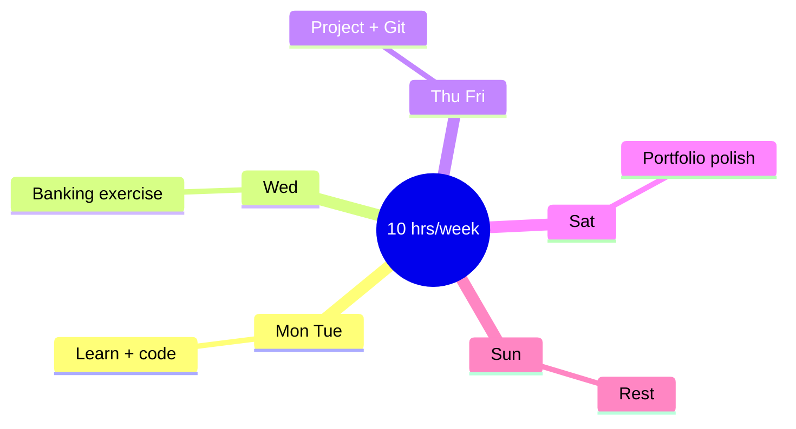

# Career & Learning Mindmap

**Center:** Zero Python + banking domain → hire-ready AI engineer  
**Regenerate decks:** `python3 scripts/generate_office_files.py`

---

## Full mindmap

---

## Simplified — 3 tracks

---

## Weekly rhythm (habit loop)

---

## How to view

- **Cursor / GitHub:** open this file — Mermaid renders in preview
- **VS Code:** install Mermaid preview extension
- **Online:** paste diagram into [mermaid.live](https://mermaid.live)
