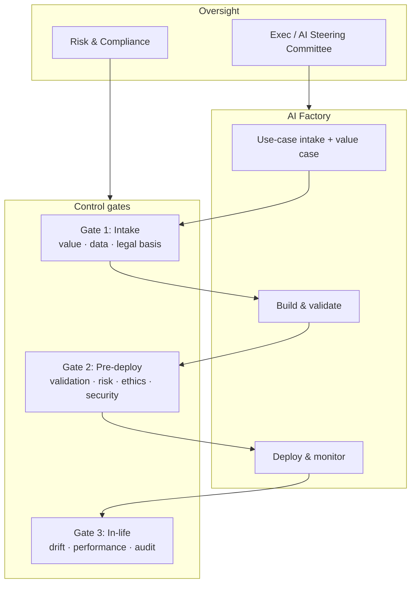
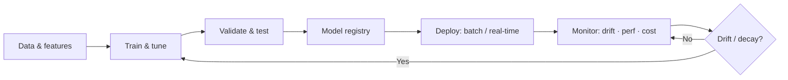
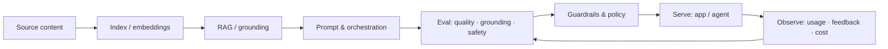
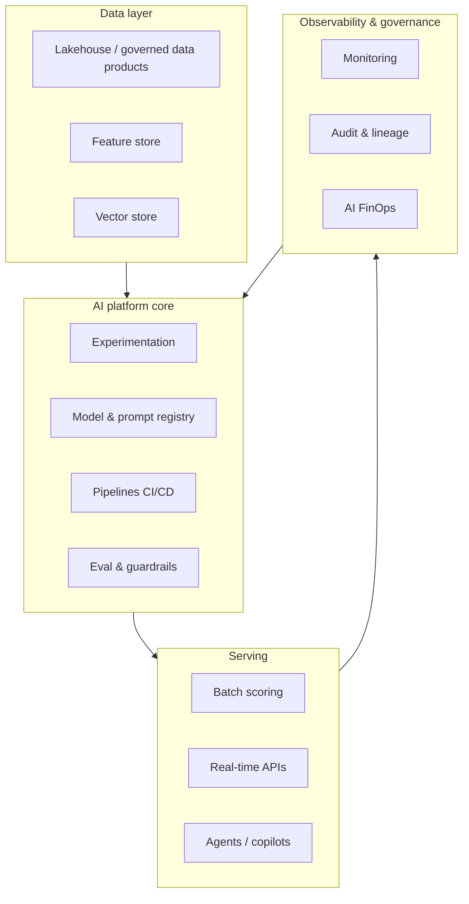

# AI Governance & MLOps / LLMOps

Companion to [strategy-and-roadmap.md](strategy-and-roadmap.md). Defines the governance framework, responsible-AI controls, and the model lifecycle the AI Factory operates.

---

## 1. AI governance framework

| Gate | When | Owner | Pass criteria |
|------|------|-------|---------------|
| **G1 Intake** | Before build | Value Lead + Risk | Business value, data availability, legal basis, risk tier set |
| **G2 Pre-deploy** | Before production | Governance Lead | Validation passed, risk/ethics review, security & privacy clear |
| **G3 In-life** | Continuous | MLOps + Model Risk | Performance within bounds, drift controlled, audit trail current |

---

## 2. Risk tiering

| Tier | Examples | Controls |
|------|----------|----------|
| **Low** | Internal productivity copilots, non-decisioning analytics | Standard review, monitoring |
| **Medium** | Marketing propensity, ops optimization | Validation + business sign-off |
| **High** | Credit scoring, fraud, customer-facing decisions | Independent validation, bias testing, explainability, regulator alignment |
| **Critical** | Automated decisions with regulatory/legal impact | Full model-risk governance, human-in-the-loop, board visibility |

Risk tier set at intake (G1) determines depth of validation and approval level.

---

## 3. Responsible AI principles

| Principle | Control |
|-----------|---------|
| **Fairness** | Bias testing across protected groups; mitigation documented |
| **Transparency** | Model cards, explainability (SHAP/feature importance) for high-tier |
| **Accountability** | Named business + model owner per use case |
| **Privacy** | Data minimization, consent basis, PII handling, DLP |
| **Security** | Access control, secrets management, adversarial robustness |
| **Human oversight** | Human-in-the-loop for high/critical decisions |
| **Robustness** | Validation, stress testing, red-teaming for GenAI |

---

## 4. MLOps lifecycle (Predictive AI)

| Stage | Practice |
|-------|----------|
| Data & features | Versioned data, feature store, lineage |
| Train & tune | Reproducible pipelines, experiment tracking |
| Validate | Holdout/temporal validation, bias & stability tests |
| Registry | Versioned models, approval status, metadata |
| Deploy | CI/CD for models, canary/shadow, rollback |
| Monitor | Data & concept drift, performance, cost, alerts |

---

## 5. LLMOps lifecycle (Generative AI)

| Stage | Practice |
|-------|----------|
| Indexing | Curated sources, refresh cadence, access scoping |
| RAG / grounding | Retrieval over authoritative data; cite sources |
| Prompt & orchestration | Versioned prompts, tools, agent workflows |
| Evaluation | Automated + human eval: relevance, grounding, safety |
| Guardrails | Input/output filters, PII redaction, policy enforcement |
| Serve | Scalable inference, caching, fallback |
| Observe | Usage, feedback loops, cost (tokens), drift in quality |

---

## 6. Platform reference architecture

**Design goals:** reusable assets, multi-cloud portability (AWS/GCP/Azure), separation of duties, full auditability, and cost transparency.

---

## 7. Compliance alignment

| Area | Practice |
|------|----------|
| Regulatory | Map use cases to applicable regulations; document decisions |
| Data protection | Lawful basis, consent, retention, residency |
| Model risk | Independent validation, periodic review, challenger models |
| Auditability | Versioned data/model/prompt, decision logs, evidence pack |
| Third-party AI | Vendor risk assessment, data-sharing controls |
