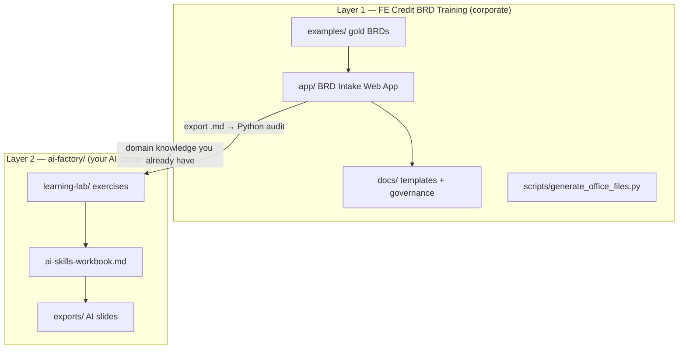

# Project Adaptation — Understand the App & Your Learning Path

**For:** Banking domain expert · zero Python · target: AI engineer / Senior BA (OCB, NAB, VPBank)  
**Map:** [.agent/PROJECT.md](../.agent/PROJECT.md) · **Start learning:** [ai-skills-workbook.md](ai-skills-workbook.md)

---

## What this repository is (two layers)



| Layer | You use it for |
|-------|----------------|
| **FE Credit package** | Domain credibility, BRD language, governance stories in interviews |
| **ai-factory** | Technical skills, portfolio repos, CV, job targeting |

You do **not** need to modify the corporate training materials unless you're customizing for FE Credit rollout. Your coding practice lives in `ai-factory/learning-lab/` and separate GitHub repos (`banking-ai-learning`, `credit-pd-model`, etc.).

---

## Understand the BRD Intake App

### What it does

Static **8-step wizard** for business users to draft a BRD before IT delivery:

```
Request → Summary → Objectives → Current → To-be → Rules → Compliance → Acceptance
```

| Feature | Code location | Business meaning |
|---------|---------------|------------------|
| Quality score (0–100%) | `app.js` → `computeScore`, `sectionScore` | Same weights as `docs/05-brd-quality-checklist.md`; gate ≥ 80% |
| Risk badge | `computeRiskLevel` | Low / Medium / High / Critical from compliance + integration flags |
| Request classifier | `getRequestTypeMeta`, `updateBucketWarning` | Redirects access/incidents to Service Desk — not BRD |
| Stakeholder routing | `computeRouting` | IT-Governance, IT-Security, GRC/Legal |
| Export | `exportBRD` | Markdown download with pipeline + routing footer |
| VI/EN | `i18n`, `applyI18n` | Toggle without reload |
| Auto-save | `localStorage` key `fecredit-brd-draft` | Draft survives refresh |

### Configuration (`app/config/fe-credit.js`)

Edit here — not in `app.js` — when adapting for another bank or training scenario:

- `businessUnits`, `applications`, `products`
- `scoreWeights` — must stay aligned with checklist doc
- `requestTypes` — BRD vs Service Desk buckets
- `complianceQuestions` — drives routing to Security/GRC

### Run it

```bash
cd app && python3 -m http.server 8080
# http://localhost:8080
```

---

## How to adapt the app for YOUR learning (not FE Credit rollout)

### Adaptation 1 — Week 1 Python exercise (live connection)

**Goal:** Prove Python reads the same rules the web app enforces.

| Step | Action |
|------|--------|
| 1 | Run the BRD app; fill a minimal BRD; export `.md` |
| 2 | `python3 week01_brd_checklist.py --app-sample` (practice) |
| 3 | `python3 week01_brd_checklist.py ~/Downloads/your-export.md` (your file) |
| 4 | Fix missing sections in app → re-export until audit passes |

**Why:** Interview story — *"I automated the same quality gate as our intake app."*

### Adaptation 2 — Week 2 loan rules (domain bridge)

`week02_loan_rules.py` mirrors **BRD Section H** business rules from `examples/04a-brd-pos-lending.md`:

- Min income 15M VND · Max DTI 40% · Min employment 12 months · Max loan 100M

**Why:** Shows BA → engineer path: rules in BRD become executable code.

### Adaptation 3 — Future AI projects use repo content

| Month | Project | Repo asset |
|-------|---------|------------|
| 6–7 | Policy RAG | Chunk `examples/04a-brd-pos-lending.md`, `docs/01-brd-template-en.md` |
| 8 | LangGraph agent | Tools query same policy chunks + `governance-mlops.md` gates |
| 9 | FastAPI | Wrap agent; validate requests like BRD form fields |
| 11 | Banking use case | Quantify value using BRD Section C KPI pattern from sample BRDs |

### Adaptation 4 — Optional FE Credit config tweak (practice only)

For learning, you may add a fictional `applications` entry:

```javascript
// app/config/fe-credit.js — practice only, do not deploy to production FE Credit
{
  id: 'policy_copilot',
  group: 'ops',
  label: { en: 'AI Policy Copilot (pilot)', vi: 'Copilot chính sách AI (thí điểm)' },
  desc: { en: 'RAG over credit policy for branch staff', vi: 'Hỏi đáp chính sách tín dụng' },
}
```

Then draft a BRD in the app for *your* future copilot — exports become RAG corpus.

---

## Your 12-month map inside this repo

| When | Read in repo | Do | Ship outside repo |
|------|--------------|-----|-------------------|
| **W1–4** | `reading-path.md` Step 1 · `docs/01-brd-template-en.md` | `week01`, `week02` | GitHub `banking-ai-learning` |
| **W5–8** | `sample_loans.csv` · SQLBolt | `week05_queries.sql` | Same repo |
| **W9–12** | `examples/04a` · StatQuest | EDA notebook | — |
| **W13–22** | `governance-mlops.md` § model validation | `credit-pd-model/` | Public GitHub |
| **W25–38** | `job-skills-adaptation.md` OCB/NAB | `policy-rag/`, `policy-copilot-agent/` | Demo video |
| **W39–44** | `governance-mlops.md` full | FastAPI + Docker + CI | — |
| **W47–52** | `cv-cover-letter.md`, `interview-kit.md` | Apply · STAR stories | LinkedIn + CV |

---

## Visual study materials (already generated)

| Artifact | Path |
|----------|------|
| Workbook (links + answers) | [ai-skills-workbook.md](ai-skills-workbook.md) |
| Skill slides | [exports/AI-Skills-Learning-Slides.pptx](exports/AI-Skills-Learning-Slides.pptx) |
| Visual journey | [exports/AI-Skills-Visual-Slides.pptx](exports/AI-Skills-Visual-Slides.pptx) |
| Interactive canvas | Cursor → `ai-skills-learning-path` |
| Career mindmap | [career-learning-mindmap.md](career-learning-mindmap.md) |

Regenerate: `python3 ai-factory/generate_ai_skills_visual_slides.py`

---

## Agent workflow in this repo

| Command | When |
|---------|------|
| `/resume` | Start session — read `.agent/SESSION.md` |
| `/understand` | Re-map structure → `.agent/PROJECT.md` |
| `/handoff` | End session — update SESSION |
| `@.cursor/commands/build.md` | Implement exercises or app changes |

CodeGraph: `codegraph query computeScore` · `codegraph query exportBRD` for app internals.

---

## What NOT to adapt (common mistakes)

| Avoid | Do instead |
|-------|------------|
| Rewrite `app.js` before learning Python basics | Complete week01–02 first |
| Put API keys in `fe-credit.js` | Use `.env` in separate AI repos |
| Change FE Credit score weights without updating `docs/05` | Keep docs and config in sync |
| Study 5 Python books at once | Follow [reading-path.md](reading-path.md) one step at a time |

---

## Your next 3 actions

1. **Today:** Run BRD app → export one BRD → run `week01_brd_checklist.py` on the markdown.
2. **This week:** Finish Python.org §1–4 + complete `week02_loan_rules.py` (compare [solutions/](learning-lab/exercises/solutions/)).
3. **This month:** Pass Skill 1 checkpoint in [workbook](ai-skills-workbook.md) before opening any ML content.
