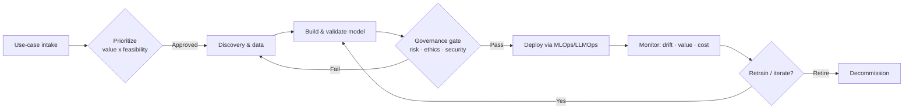
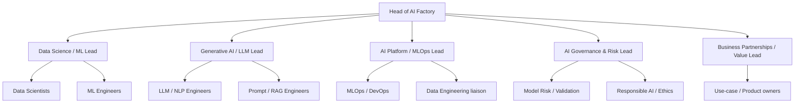

# AI Factory — Strategy, Operating Model & Roadmap

Companion to [README.md](README.md). Covers the AI strategy, operating model, organization, 90-day plan, and value/KPI framework for the Head of AI Factory.

---

## 1. Strategy on a page

| Pillar | Objective | Outcome |
|--------|-----------|---------|
| **Business value** | Tie every AI initiative to a measurable business outcome | ROI-positive portfolio |
| **Predictive AI** | Forecasting, scoring, optimization at scale | Better risk, pricing, CX decisions |
| **Generative AI** | LLMs, RAG, AI agents for productivity & service | Faster ops, richer customer experience |
| **Platform** | Reusable assets, scalable AI/ML infrastructure | Lower cost & time-to-value per use case |
| **Governance** | Responsible, compliant, secure AI | Trust, auditability, regulatory alignment |
| **People** | Talent, capability, culture | Durable AI advantage |

**Strategic principle:** *Value-led, platform-powered, governance-assured.* No model reaches production without a named business owner, measurable value, and a passed governance gate.

---

## 2. Operating model — the "AI Factory"

**Intake → Value loop:** the factory runs as a repeatable pipeline so each new use case reuses platform components, governance templates, and MLOps tooling — driving down marginal cost per model.

---

## 3. Use-case portfolio (illustrative)

| Domain | Predictive AI | Generative AI |
|--------|---------------|---------------|
| Credit & risk | Credit scoring, PD/LGD, early-warning | Policy copilots, document summarization |
| Growth & CX | Propensity, churn, next-best-offer | Customer service agents, personalization |
| Operations | Demand forecasting, process optimization | Ops copilots, knowledge RAG, code assist |
| Fraud & financial crime | Anomaly detection, transaction scoring | Investigation assistants, alert triage |
| Finance | Cashflow forecasting, scenario modeling | Report generation, analyst copilots |

**Selection criteria:** business value (revenue/cost/risk), data readiness, feasibility, regulatory exposure, reusability.

---

## 4. Organization

| Function | Mission |
|----------|---------|
| Data Science / ML | Predictive models: scoring, forecasting, optimization |
| Generative AI / LLM | LLMs, RAG, agents; safe and grounded GenAI |
| AI Platform / MLOps | Reusable platform, pipelines, infra, lifecycle automation |
| AI Governance & Risk | Model risk, validation, responsible AI, compliance |
| Business Partnerships | Use-case discovery, ROI, adoption, value realization |

---

## 5. Technology stack

| Layer | Examples |
|-------|----------|
| Languages | Python, R, SQL |
| ML / DL | scikit-learn, XGBoost, PyTorch, TensorFlow |
| GenAI | LLM APIs + open models, RAG frameworks, vector DBs, agent frameworks |
| Distributed compute | Spark, Hadoop |
| Cloud | AWS, GCP, Azure (multi-cloud aware) |
| MLOps / LLMOps | Pipelines, feature store, model registry, eval & guardrails, monitoring |
| Data | Lakehouse, governed data products, lineage |

---

## 6. 90-day plan

```mermaid
gantt
  title Head of AI Factory — first 90 days
  dateFormat X
  axisFormat D%s
  section Listen & assess (0-30)
  Stakeholder & exec alignment    :a1, 0, 30
  Maturity & data readiness audit :a2, 0, 30
  Use-case backlog & quick wins   :a3, 10, 20
  section Frame & fund (30-60)
  Ratify AI strategy & portfolio  :b1, 30, 30
  Governance & responsible-AI baseline :b2, 30, 30
  Platform/MLOps target architecture :b3, 35, 25
  section Deliver & scale (60-90)
  Ship 1-2 quick-win models       :c1, 60, 30
  Stand up MLOps/LLMOps pipeline  :c2, 60, 30
  Operating model & hiring plan   :c3, 65, 25
```

| Phase | Focus | Key outputs |
|-------|-------|-------------|
| **0–30 Listen & assess** | Stakeholders, maturity, data, quick wins | Maturity assessment; prioritized backlog |
| **30–60 Frame & fund** | Strategy, governance, platform target | Ratified strategy; governance baseline; architecture |
| **60–90 Deliver & scale** | Quick wins, pipeline, operating model | 1–2 models in prod; MLOps live; hiring plan |

---

## 7. Value & KPI framework

| Category | KPI | Target signal |
|----------|-----|---------------|
| Business value | Net ROI of AI portfolio | Positive & growing |
| Delivery | Use cases in production / quarter | Increasing throughput |
| Time-to-value | Idea → production cycle time | Decreasing |
| Reuse | % use cases using shared platform/assets | ↑ toward majority |
| Quality | Model performance vs baseline; drift incidents | Stable / improving |
| GenAI safety | Grounded-response rate; guardrail violations | High / near-zero |
| Governance | % models passing governance gate first time | ↑ |
| Adoption | Active business users / agent usage | ↑ |
| People | Capability index; attrition of key talent | ↑ / low |

**Value discipline:** each use case has a baseline, target, owner, and measurement method agreed *before* build — mirroring a business-requirements (BRD) gate.

---

## 8. Key risks & mitigations

| Risk | Mitigation |
|------|------------|
| AI without business value | Mandatory value case + owner before build |
| Model risk / drift | Validation, monitoring, retraining triggers |
| GenAI hallucination / data leakage | RAG grounding, guardrails, red-teaming, DLP |
| Regulatory / ethical exposure | Governance gate, responsible-AI policy, audit trail |
| Platform sprawl / cost | Reusable platform, FinOps for AI, decommission policy |
| Talent gaps | Workforce plan, upskilling, partner ecosystem |
