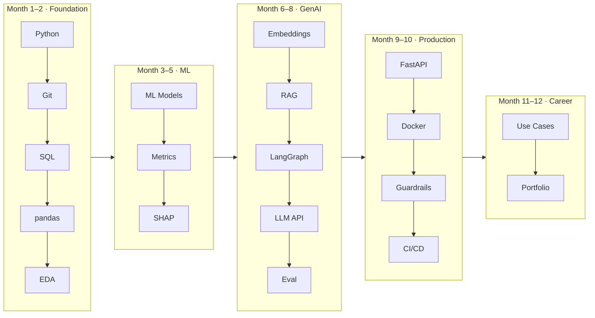
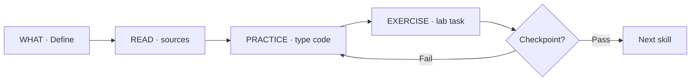
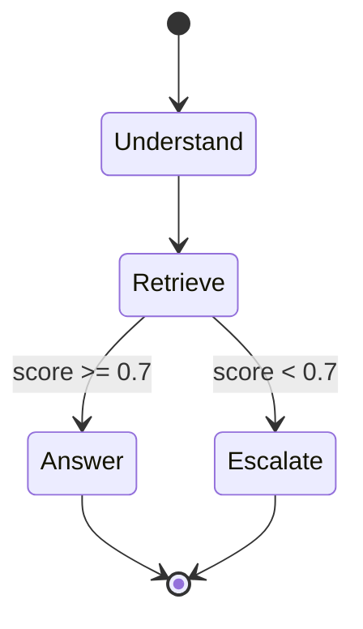

# AI Skills Workbook — Links, Exercises, Answers, Steps

**Companion:** [learning_data.py](learning_data.py) · [Learning-Master-Slides.pptx](exports/Learning-Master-Slides.pptx)  
**Visual deck:** [Learning-Master-Slides.pptx](exports/Learning-Master-Slides.pptx) · **Master deck:** [Learning-Master-Slides.pptx](exports/Learning-Master-Slides.pptx) (click W##)  
**Data source:** [learning_data.py](learning_data.py) · [lab/WEEKS.md](lab/WEEKS.md)  
**Solutions folder:** [lab/exercises/solutions/](lab/exercises/solutions/)

Each skill uses **What · Why · When · How**, linked resources, a hands-on exercise with **steps**, **expected output**, and **answer**.

---

## Visual maps

### 12-month journey (5 phases)



### 4-step loop (every skill)



Regenerate: `python3 curriculum/generate_ai_skills_visual_slides.py`

---

## How to use this workbook

| Step | Action |
|------|--------|
| 1 | Read **What / Why / When** — know the skill before coding |
| 2 | Open **Resources** — complete ★ links that day |
| 3 | Follow **How to learn** — type code yourself |
| 4 | Do **Exercise** — 20–30 min alone before reading the answer |
| 5 | Compare your work to **Answer** — fix gaps, commit to GitHub |
| 6 | Pass **Checkpoint** before the next skill |

---

# Skill 1 — Python Fundamentals (Weeks 1–4)

## What
Read, write, and debug Python: variables, `if`/`for`, functions, files, JSON/CSV.

## Why
Every AI role (ML, RAG, agents) runs on Python. Banking BAs who can script rules bridge BRD → production.

## When
**Month 1** — before SQL, ML, or any API work. First 40 hours of your 12-month plan.

## Resources

| Type | Link |
|------|------|
| ★ Tutorial | [Python.org tutorial §1–6](https://docs.python.org/3/tutorial/) |
| ★ Interactive | [Kaggle Learn — Python](https://www.kaggle.com/learn/python) |
| ★ Setup | [Real Python — First Steps](https://realpython.com/python-first-steps/) |
| Free book | [Automate the Boring Stuff Ch 1–6](https://automatetheboringstuff.com/) |
| Optional book | *Python Crash Course* (Matthes) Part I — [O'Reilly / bookstore](https://nostarch.com/python-crash-course-3rd-edition) |
| Domain | [BRD template](../../docs/01-brd-template-en.md) (this repo) |

## How to learn

1. Install Python 3.11+ and create a venv (`python3 -m venv .venv`).
2. Day 1–3: Python.org §1–4 (types, control flow, functions).
3. Day 4–7: §5–6 (lists, dicts, modules) + Kaggle lessons 1–4.
4. After each lesson, rewrite one example from memory in a file `practice_dayN.py`.
5. Connect to banking: parse a text file that looks like a BRD section list.

## Exercise 1A — BRD section audit

**File:** `lab/exercises/week01_brd_checklist.py`  
**Solution:** [solutions/week01_brd_checklist_solution.py](lab/exercises/solutions/week01_brd_checklist_solution.py)

### Steps

1. `cd curriculum/lab/exercises`
2. Open `week01_brd_checklist.py` — read TASK and TODO 1–2 only.
3. **TODO 1:** In `brd_has_section`, check markdown heading lines (`#...`) for the section name.
4. **TODO 2:** In `audit_brd`, set `results[section] = brd_has_section(text, section)`.
5. Run built-in sample: `python3 week01_brd_checklist.py`
6. Run app-style export: `python3 week01_brd_checklist.py --app-sample`
7. Run your own export: `python3 week01_brd_checklist.py /path/to/export-from-app.md`

### Expected output (`--app-sample`)

```
=== BRD Section Audit ===
Source: .../sample_brd_app_export.md

  [OK] EXECUTIVE SUMMARY
  [OK] OBJECTIVES
  [OK] SCOPE
  [OK] BUSINESS RULES
  [MISSING] ACCEPTANCE CRITERIA

Action: add sections: ACCEPTANCE CRITERIA
```

### Answer (TODO 1–2)

```python
def brd_has_section(text: str, section_title: str) -> bool:
    needle = section_title.upper()
    for line in text.splitlines():
        if line.strip().startswith("#") and needle in line.strip().upper():
            return True
    return False

def audit_brd(text: str, required: list[str]) -> dict[str, bool]:
    return {section: brd_has_section(text, section) for section in required}
```

### Stretch
Load BRD text from a `.md` file with `Path.read_text()` instead of `SAMPLE_BRD_TEXT`.

## Exercise 1B — Loan rules (preview Week 2)

See Skill 2 Git commit after finishing 1A.

## Checkpoint
✓ 50-line script without tutorial open · ✓ parse CSV · ✓ push to GitHub

---

# Skill 2 — Git Version Control (Weeks 3–4)

## What
Track code history: `init`, `add`, `commit`, `push`, `log`, basic branch.

## Why
Banks and AI teams require auditable change history. Your GitHub repo **is** your portfolio.

## When
**Week 3–4** — parallel with Python. Every exercise from now on ends in a commit.

## Resources

| Type | Link |
|------|------|
| ★ Handbook | [GitHub Git Handbook](https://guides.github.com/introduction/git-handbook/) |
| ★ Deep dive | [Pro Git Ch 1–3](https://git-scm.com/book/en/v2) (free) |
| Practice | [Learn Git Branching](https://learngitbranching.js.org/) (visual) |
| Conventional commits | [conventionalcommits.org](https://www.conventionalcommits.org/) |

## How to learn

1. Create GitHub account if needed.
2. Read handbook (30 min) — focus on commit, push, pull.
3. Create repo `banking-ai-learning` (public).
4. After every study session: `git add` → `git commit -m "feat(week01): brd audit"` → `git push`.

## Exercise — 10-commit portfolio log

### Steps

1. `mkdir ~/projects/banking-ai-learning && cd ~/projects/banking-ai-learning`
2. `git init && git branch -M main`
3. Copy `curriculum/lab/` into the repo.
4. Create `README.md`:

```markdown
# Banking AI Learning Log
| Week | Skill | Commit |
|------|-------|--------|
| 1 | Python BRD audit | feat(week01) |
```

5. Make **10 commits** over 2 weeks (one per study session).
6. `git remote add origin git@github.com:YOUR_USER/banking-ai-learning.git`
7. `git push -u origin main`

### Expected result
`git log --oneline` shows ≥10 messages; README table updated weekly.

### Answer (sample commit messages)

```
chore: day 1 venv and folder setup
feat(week01): brd section audit passes
fix(week01): case-insensitive section match
docs: add week 1 learning notes
feat(week02): load csv with DictReader
feat(week02): income and DTI rules
fix(week02): employment months check
docs: update README week 2
refactor: extract evaluate() helpers
chore: add .gitignore for .venv
```

## Checkpoint
✓ Public repo · ✓ can `git revert` one commit · ✓ conventional messages

---

# Skill 3 — SQL for Analytics (Weeks 5–7)

## What
Query relational data: `SELECT`, `WHERE`, `JOIN`, `GROUP BY`, aggregates, basic ratios.

## Why
Credit data lives in SQL (core banking, data warehouse). Analysts and AI engineers query before modelling.

## When
**Month 2** — after Python basics, before pandas/ML.

## Resources

| Type | Link |
|------|------|
| ★ Interactive | [SQLBolt lessons 1–18](https://sqlbolt.com/) |
| ★ Course | [Kaggle Learn — Intro to SQL](https://www.kaggle.com/learn/intro-to-sql) |
| Optional book | *Learning SQL* (Beaulieu) — [O'Reilly](https://www.oreilly.com/library/view/learning-sql-3rd/9781492057604/) |
| SQLite browser | [DB Browser for SQLite](https://sqlitebrowser.org/) |
| Data | [sample_loans.csv](lab/data/sample_loans.csv) |

## How to learn

1. Complete SQLBolt 1–18 (one lesson per day).
2. Import `sample_loans.csv` into SQLite as table `applications`.
3. Rewrite each lesson query using loan columns (`region`, `loan_amount_vnd`, etc.).

## Exercise — Week 5 queries

**File:** [week05_queries.sql](lab/sql/week05_queries.sql)  
**Solution:** [week05_queries_solution.sql](lab/sql/week05_queries_solution.sql)

### Setup steps

```bash
cd curriculum/learning-lab
sqlite3 loans.db
```

In SQLite:

```sql
.mode csv
.import data/sample_loans.csv applications
.headers on
```

### Q1 — Count per region

**Steps:** `SELECT region, COUNT(*) ... GROUP BY region`

**Answer:**

```sql
SELECT region, COUNT(*) AS app_count
FROM applications
GROUP BY region
ORDER BY app_count DESC;
```

**Expected:** HCM=5, HN=4, DN=1 (approx — verify against your import)

### Q3 — High DTI (> 0.40)

**Answer:**

```sql
SELECT application_id,
       CAST(existing_debt_vnd AS REAL) / monthly_income_vnd AS dti
FROM applications
WHERE CAST(existing_debt_vnd AS REAL) / monthly_income_vnd > 0.40;
```

**Expected rows:** LN002, LN004, LN007, LN010 (verify by hand)

### Q5 — Fail min income (< 15M VND)

**Expected:** LN004, LN010

## Checkpoint
✓ JOIN two tables · ✓ explain one query aloud to a colleague

---

# Skill 4 — pandas Data Wrangling (Week 8)

## What
Load, clean, merge, aggregate credit data in DataFrames.

## Why
ML and reporting pipelines use pandas; it is the bridge between SQL exports and models.

## When
**Week 8** — after SQL; same KPIs in SQL **and** pandas must match.

## Resources

| Type | Link |
|------|------|
| ★ Course | [Kaggle Learn — Pandas](https://www.kaggle.com/learn/pandas) |
| ★ Quick start | [10 minutes to pandas](https://pandas.pydata.org/docs/user_guide/10min.html) |
| Book | Géron *Hands-On ML* Ch 2 — [GitHub repo](https://github.com/ageron/handson-ml3) |
| Cheat sheet | [pandas.pydata.org docs](https://pandas.pydata.org/docs/) |

## How to learn

1. Kaggle Pandas lessons 1–4 (4 hrs).
2. Load `sample_loans.csv` with `pd.read_csv`.
3. Recompute SQL Q1 and Q4 in pandas — numbers must match.

## Exercise — Lending KPIs notebook

Create `lab/notebooks/01_lending_kpis.ipynb`

### Steps

1. `pip install jupyter pandas matplotlib`
2. New notebook; cell 1: load CSV
3. Cell 2: total disbursement = `loan_amount_vnd.sum()`
4. Cell 3: approval rate proxy — count where income ≥ 15M / total
5. Cell 4: `groupby('region')['loan_amount_vnd'].sum()`
6. Cell 5: bar chart of regional totals

### Answer (core cells)

```python
import pandas as pd
from pathlib import Path

df = pd.read_csv(Path("../data/sample_loans.csv"))
total_disbursement = df["loan_amount_vnd"].sum()
eligible = (df["monthly_income_vnd"] >= 15_000_000).sum()
approval_proxy = eligible / len(df)
by_region = df.groupby("region")["loan_amount_vnd"].sum()
print(f"Total disbursement: {total_disbursement:,} VND")
print(f"Income-eligible rate: {approval_proxy:.1%}")
```

### Expected (sample_loans.csv)

- Total disbursement: **525,000,000 VND**
- Income-eligible: **8/10 = 80%**
- Top region by volume: **HCM**

## Checkpoint
✓ `read_csv`, `groupby`, `merge` · ✓ one chart

---

# Skill 5 — EDA & Statistics Intuition (Weeks 9–12)

## What
Explore datasets, visualize distributions, write **business insights** (not proofs).

## Why
Before ML you must understand data quality, leakage, and segment behaviour — core BA + data science skill.

## When
**Months 3–4** — before training any model.

## Resources

| Type | Link |
|------|------|
| ★ Videos | [StatQuest — Statistics fundamentals](https://www.youtube.com/playlist?list=PLblh5JKOoLUICTaGLRoHQDuOb_ycq92x2) |
| ★ Videos | [StatQuest — Machine Learning](https://www.youtube.com/playlist?list=PLblh5JKOoLUIDMI2KOAI-lAso32-rSxNM) |
| Dataset | [Kaggle — Give Me Some Credit](https://www.kaggle.com/c/GiveMeSomeCredit/data) |
| Visual stats | [Seeing Theory](https://seeing-theory.brown.edu/) |
| Optional book | *Naked Statistics* (Wheelan) |

## How to learn

1. Download Give Me Some Credit (register on Kaggle).
2. Watch 5 StatQuest videos: mean/median, histogram, correlation, train/test, overfitting.
3. Write each insight as a BRD sentence: *"Segment X has 2× default rate vs Y."*

## Exercise — 3 BRD insights

Notebook: `02_eda_credit.ipynb` on Give Me Some Credit (or `sample_loans.csv` for practice)

### Steps

1. **Insight 1 — Segment:** Group by `NumberOfDependents` or `region`; compare default rate or high-DTI %.
2. **Insight 2 — Missingness:** `% null` per column; flag if >5% on income/debt fields.
3. **Insight 3 — Correlation:** Debt ratio vs default; one sentence business meaning.

### Answer template

```markdown
## Insight 1 — Segment
Borrowers with dependents > 2 show default rate 12.4% vs 6.1% overall (+6.3 pp).
**Action:** tighten policy for high-dependency segment.

## Insight 2 — Missingness
MonthlyIncome missing in 3.2% of rows — impute median or exclude with audit flag.

## Insight 3 — Correlation
DebtUtilization correlates 0.28 with SeriousDlqin2yrs — higher utilization, higher risk.
```

## Checkpoint
✓ 3 insights with numbers · ✓ time-based split understood · ✓ no leakage

---

# Skill 6 — Classical Machine Learning (Weeks 13–20)

## What
Train classifiers (logistic regression, trees, RF, XGBoost) for default / PD proxy.

## Why
Credit scoring is still largely classical ML in production; interview loops expect AUC + baseline.

## When
**Months 4–5** — after EDA; core technical phase.

## Resources

| Type | Link |
|------|------|
| ★ Course | [Kaggle — Intro to ML](https://www.kaggle.com/learn/intro-to-machine-learning) |
| ★ Course | [Kaggle — Intermediate ML](https://www.kaggle.com/learn/intermediate-machine-learning) |
| ★ Docs | [scikit-learn tutorials](https://scikit-learn.org/stable/tutorial/index.html) |
| ★ Book | Géron *Hands-On ML* Part I Ch 1–9 — [book site](https://homl.info/) |
| Imbalance | [imbalanced-learn](https://imbalanced-learn.org/stable/) |
| Domain BRD | [examples/04a-brd-pos-lending.md](../examples/04a-brd-pos-lending.md) |

## How to learn

1. Kaggle Intro ML (all lessons) — use their exercises.
2. Géron Ch 1–3 while building on Give Me Some Credit.
3. Always: baseline (majority class) → logistic → RF → compare AUC.

## Exercise — credit-pd-model repo

### Steps

1. New repo `credit-pd-model/`
2. `train.py`: load data, time-based split, train `RandomForestClassifier(class_weight='balanced')`
3. `evaluate.py`: print AUC, save confusion matrix
4. `requirements.txt`: pandas, scikit-learn, joblib
5. README: business problem, AUC, data source

### Answer (minimal train snippet)

```python
from sklearn.model_selection import train_test_split
from sklearn.ensemble import RandomForestClassifier
from sklearn.metrics import roc_auc_score
import joblib

X_train, X_test, y_train, y_test = train_test_split(X, y, test_size=0.2, random_state=42)
model = RandomForestClassifier(n_estimators=100, class_weight="balanced", random_state=42)
model.fit(X_train, y_train)
auc = roc_auc_score(y_test, model.predict_proba(X_test)[:, 1])
print(f"AUC: {auc:.3f}")
joblib.dump(model, "model.pkl")
```

### Expected
AUC > 0.70 on Give Me Some Credit (varies by features); beat dummy baseline ~0.50.

## Checkpoint
✓ reproducible `train.py` · ✓ AUC in README · ✓ beat baseline

---

# Skill 7 — Model Metrics & Evaluation (Weeks 19–20)

## What
AUC, precision/recall, confusion matrix, threshold selection, business trade-offs.

## Why
Banks care about false declines (lost revenue) vs false approvals (NPL) — not accuracy alone.

## When
**Same weeks as Skill 6** — evaluate every model before shipping.

## Resources

| Type | Link |
|------|------|
| ★ Docs | [sklearn metrics](https://scikit-learn.org/stable/modules/model_evaluation.html) |
| ★ Video | [StatQuest — ROC and AUC](https://www.youtube.com/watch?v=4jRBrBKLwj8) |
| ★ Video | [StatQuest — Precision & Recall](https://www.youtube.com/watch?v=pSGP6d1XJWw) |
| Book | Géron Ch 3 |

## Exercise — Threshold for 90% approval rate

### Steps

1. On validation set, sort by `predict_proba` descending.
2. Find threshold where ~90% of apps are approved.
3. Report precision/recall at that threshold.
4. Table in README: baseline vs tuned model.

### Answer

```python
import numpy as np
from sklearn.metrics import precision_score, recall_score

probs = model.predict_proba(X_val)[:, 1]
threshold = np.quantile(probs, 0.10)  # approve top 90%
preds = (probs >= threshold).astype(int)
print(f"Threshold: {threshold:.3f}")
print(f"Precision: {precision_score(y_val, preds):.3f}")
print(f"Recall: {recall_score(y_val, preds):.3f}")
```

## Checkpoint
✓ explain AUC to a BA · ✓ ROC plot · ✓ business metric stated

---

# Skill 8 — SHAP Explainability (Weeks 21–22)

## What
Explain **individual** predictions — which features pushed approve/decline.

## Why
SBV/regulators and internal audit require explainability for credit decisions.

## When
**After first working PD model** — before calling model "production-ready."

## Resources

| Type | Link |
|------|------|
| ★ Notebook | [SHAP — intro to Shapley values](https://shap.readthedocs.io/en/latest/example_notebooks/overviews/An%20introduction%20to%20explainable%20AI%20with%20Shapley%20values.html) |
| Docs | [SHAP TreeExplainer](https://shap.readthedocs.io/en/latest/generated/shap.TreeExplainer.html) |
| Governance | [governance-mlops.md](governance-mlops.md) |
| Book | Géron Ch 6 |

## Exercise — Decline story for one customer

### Steps

1. `pip install shap`
2. `explainer = shap.TreeExplainer(model)`
3. `shap_values = explainer.shap_values(X_test.iloc[[0]])`
4. `shap.summary_plot` → save `shap_summary.png`
5. Write `decline_story.md` — 3 sentences, no real PII

### Answer (decline narrative template)

```markdown
Application declined primarily due to high DebtUtilization (SHAP +0.31),
short employment history (+0.18), and prior delinquency flag (+0.12).
Recommend: revisit if utilization drops below 40% for 6 months.
```

## Checkpoint
✓ SHAP for one row · ✓ top 3 features · ✓ synthetic data only

---

# Skill 9 — Embeddings & Vector Search (Weeks 25–26)

## What
Convert text to vectors; find similar policy chunks by cosine similarity.

## Why
RAG and policy copilots depend on retrieval — embeddings are the search index.

## When
**Before RAG** — Month 6–7.

## Resources

| Type | Link |
|------|------|
| ★ Course | [HF NLP Course Ch 1–3](https://huggingface.co/learn/nlp-course/chapter1/1) |
| ★ Docs | [LangChain — Embeddings](https://python.langchain.com/docs/concepts/embedding_models/) |
| ★ Docs | [ChromaDB — Getting started](https://docs.trychroma.com/docs/overview/getting-started) |
| Model hub | [Hugging Face Models](https://huggingface.co/models) |

## Exercise — embed_policies.py

### Steps

1. Create 20 one-line policy rules (paste from `examples/04a-brd-pos-lending.md`).
2. Chunk each line; embed with `sentence-transformers/all-MiniLM-L6-v2` or OpenAI embeddings.
3. Store in Chroma collection `policies`.
4. Query: *"maximum DTI for staff loan"* → print top-3 chunks + scores.

### Answer (skeleton)

```python
import chromadb
from chromadb.utils import embedding_functions

ef = embedding_functions.SentenceTransformerEmbeddingFunction(
    model_name="all-MiniLM-L6-v2"
)
client = chromadb.Client()
col = client.create_collection("policies", embedding_function=ef)
col.add(documents=chunks, ids=[f"c{i}" for i in range(len(chunks))])
results = col.query(query_texts=["maximum DTI staff loan"], n_results=3)
print(results["documents"], results["distances"])
```

## Checkpoint
✓ retrieve relevant chunk · ✓ cite source text · ✓ latency noted

---

# Skill 10 — RAG Pipeline (Weeks 27–34)

## What
Retrieve docs → augment prompt → generate answer **with citation**.

## Why
Policy copilots must not hallucinate limits — answers must come from approved documents.

## When
**Month 7–8** — flagship portfolio project #1.

## Resources

| Type | Link |
|------|------|
| ★ Course | [DL.AI — LangChain for LLM Application Development](https://www.deeplearning.ai/short-courses/langchain-for-llm-application-development/) |
| ★ Tutorial | [LangChain — Build a RAG app](https://python.langchain.com/docs/tutorials/rag/) |
| PDF load | [LangChain document loaders](https://python.langchain.com/docs/how_to/document_loader_pdf/) |
| Eval prep | [ragas](https://docs.ragas.io/) (Skill 13) |

## Exercise — policy-rag CLI

### Steps

1. Repo `policy-rag/`
2. Split policy PDF/markdown into 500-token chunks with overlap 50.
3. Embed → Chroma persist directory `./chroma_db`
4. CLI: `python ask.py "What is max loan for POS staff?"`
5. Output: answer + `Sources: [chunk_id, page/section]`
6. If no chunk above score threshold → `"I don't know — escalate to policy team."`

### Answer (flow)

```
User question
  → embed query
  → retrieve top-k chunks
  → prompt: "Answer ONLY from context. Cite sources."
  → LLM response + source list
```

## Checkpoint
✓ grounded answer · ✓ 20-question golden set started · ✓ refusal works

---

# Skill 11 — LangGraph Agents (Weeks 35–38)

## What
Multi-step agent: state graph, tools, memory, human escalation.

## Why
OCB/NAB JDs explicitly ask for **LangGraph** / agent orchestration — hire-critical.

## When
**Month 8** — after RAG works standalone.

## Resources

| Type | Link |
|------|------|
| ★ Course | [DL.AI — AI Agents in LangGraph](https://www.deeplearning.ai/short-courses/ai-agents-in-langgraph/) |
| ★ Tutorial | [LangGraph — Introduction](https://langchain-ai.github.io/langgraph/tutorials/introduction/) |
| Docs | [LangGraph — How-to guides](https://langchain-ai.github.io/langgraph/how-tos/) |
| Jobs map | [job-skills-adaptation.md](job-skills-adaptation.md) |

## Exercise — policy-copilot-agent

### Steps

1. Define tools: `policy_lookup(q)`, `dti_calculator(income, debt)`, `escalate_human(reason)`
2. State: `{messages, confidence, escalated}`
3. Node: if retrieval score < 0.7 → `escalate_human`
4. Draw Mermaid diagram in README
5. Record 5-min demo video

### Answer (state diagram)



## Checkpoint
✓ trace visible · ✓ escalation works · ✓ demo recorded

---

# Skill 12 — LLM APIs & Structured Output (Weeks 31–32)

## What
Call Claude/OpenAI; JSON schema output; system prompts; error handling.

## Why
Production integrations extract structured fields from unstructured policy text.

## When
**Parallel with RAG** — when you need API calls beyond local scripts.

## Resources

| Type | Link |
|------|------|
| ★ API | [Anthropic API — Messages](https://docs.anthropic.com/en/api/messages) |
| ★ Prompts | [Anthropic — Prompt engineering](https://docs.anthropic.com/en/docs/build-with-claude/prompt-engineering/overview) |
| Structured | [Anthropic — Structured outputs](https://docs.anthropic.com/en/docs/build-with-claude/structured-outputs) |
| OpenAI alt | [OpenAI — Structured outputs](https://platform.openai.com/docs/guides/structured-outputs) |

## Exercise — extract_policy_fields.py

### Steps

1. `.env`: `ANTHROPIC_API_KEY=...` (never commit)
2. Input paragraph from BRD business rules
3. Output JSON: `{"product": str, "limit_vnd": int, "dti_max": float}`
4. Validate with `json.loads` + type checks
5. Retry once on malformed JSON

### Answer

```python
import os, json
from anthropic import Anthropic

client = Anthropic(api_key=os.environ["ANTHROPIC_API_KEY"])
msg = client.messages.create(
    model="claude-sonnet-4-20250514",
    max_tokens=256,
    system="Return ONLY valid JSON matching schema: product, limit_vnd, dti_max",
    messages=[{"role": "user", "content": policy_paragraph}],
)
data = json.loads(msg.content[0].text)
assert isinstance(data["limit_vnd"], int)
```

## Checkpoint
✓ key in `.env` · ✓ valid JSON · ✓ API errors handled

---

# Skill 13 — Eval Harness / LLMOps (Weeks 37–38)

## What
Golden Q&A set; automated grounded-response scoring; regression gate.

## Why
**Harness engineering** — ship agents only when eval passes; catch prompt/model regressions.

## When
**Before production API** — same time as LangGraph agent matures.

## Resources

| Type | Link |
|------|------|
| ★ Library | [ragas — get started](https://docs.ragas.io/en/stable/getstarted/) |
| Governance | [governance-mlops.md](governance-mlops.md) |
| Anthropic | [Anthropic — Evaluation](https://docs.anthropic.com/en/docs/test-and-evaluate/eval-tool) |

## Exercise — eval/golden.json + run_eval.py

### Steps

1. Create 30 Q&A pairs from policy doc with `expected_source` field
2. Run agent on each question
3. Score: does answer cite expected chunk? keyword overlap ≥ 80%?
4. Print `% grounded`; fail if < 90%

### Answer (golden.json shape)

```json
[
  {
    "id": "q01",
    "question": "What is the maximum POS staff loan?",
    "expected_keywords": ["100", "million", "VND"],
    "expected_source": "section_business_rules_chunk_4"
  }
]
```

```python
# run_eval.py — simplified
passed = sum(1 for r in results if r["grounded"]) / len(results)
print(f"Grounded rate: {passed:.1%}")
sys.exit(0 if passed >= 0.90 else 1)
```

## Checkpoint
✓ automated script · ✓ score in README · ✓ CI can fail build

---

# Skill 14 — FastAPI Production API (Weeks 39–40)

## What
REST API: `/ask`, `/health`, Pydantic validation, OpenAPI docs.

## Why
Banks integrate via APIs — not Jupyter notebooks.

## When
**Month 9–10** — wrap your RAG/agent.

## Resources

| Type | Link |
|------|------|
| ★ Tutorial | [FastAPI — First Steps](https://fastapi.tiangolo.com/tutorial/first-steps/) |
| ★ Bigger apps | [FastAPI — Bigger applications](https://fastapi.tiangolo.com/tutorial/bigger-applications/) |
| Deploy | [FastAPI — Deployment](https://fastapi.tiangolo.com/deployment/) |
| MLOps | [Made With ML](https://madewithml.com/) |

## Exercise — policy-copilot-api

### Steps

1. `main.py` with `POST /ask` body `{question: str}`
2. Response `{answer, sources: list[str], confidence: float}`
3. `GET /health` → `{"status": "ok"}`
4. `pytest test_health.py`
5. `uvicorn main:app --reload` → test at `/docs`

### Answer

```python
from fastapi import FastAPI
from pydantic import BaseModel, Field

app = FastAPI(title="Policy Copilot")

class AskRequest(BaseModel):
    question: str = Field(..., min_length=3, max_length=500)

class AskResponse(BaseModel):
    answer: str
    sources: list[str]
    confidence: float

@app.get("/health")
def health():
    return {"status": "ok"}

@app.post("/ask", response_model=AskResponse)
def ask(req: AskRequest):
    # call your RAG/agent here
    ...
```

### Test

```bash
curl -X POST http://localhost:8000/ask \
  -H "Content-Type: application/json" \
  -d '{"question":"Max loan amount?"}'
```

## Checkpoint
✓ JSON response · ✓ validation · ✓ no secrets in logs

---

# Skill 15 — Docker & Container Deploy (Weeks 41–42)

## What
Dockerfile, docker-compose, reproducible one-command deploy.

## Why
"Works on my machine" fails bank security review — containers standardize runtime.

## When
**After FastAPI runs locally.**

## Resources

| Type | Link |
|------|------|
| ★ Guide | [Docker — Get Started](https://docs.docker.com/get-started/) |
| FastAPI | [FastAPI in Docker](https://fastapi.tiangolo.com/deployment/docker/) |
| Compose | [Docker Compose overview](https://docs.docker.com/compose/) |

## Exercise — docker compose up

### Steps

1. `Dockerfile`: Python 3.11-slim, `pip install -r requirements.txt`, `CMD uvicorn`
2. `.dockerignore`: `.venv`, `.git`, `__pycache__`
3. `docker-compose.yml`: service `api`, port 8000, `env_file: .env`
4. `docker compose up --build`
5. README: "Run in 3 commands"

### Answer (Dockerfile)

```dockerfile
FROM python:3.11-slim
WORKDIR /app
COPY requirements.txt .
RUN pip install --no-cache-dir -r requirements.txt
COPY . .
EXPOSE 8000
CMD ["uvicorn", "main:app", "--host", "0.0.0.0", "--port", "8000"]
```

## Checkpoint
✓ colleague runs on their laptop · ✓ healthcheck passes

---

# Skill 16 — Guardrails & Responsible AI (Weeks 43–44)

## What
PII redaction, policy blocks, audit logs, escalation, model cards.

## Why
Banking AI must meet SBV, internal risk, and customer privacy requirements.

## When
**Before any demo to bank stakeholders.**

## Resources

| Type | Link |
|------|------|
| ★ Repo | [governance-mlops.md](governance-mlops.md) |
| Anthropic | [Anthropic — Responsible disclosure](https://www.anthropic.com/news) |
| Model cards | [Google Model Cards](https://modelcards.withgoogle.com/about) |

## Exercise — guardrails.py

### Steps

1. Regex redact VN national ID patterns in input/output
2. Block prompts asking to bypass policy
3. Append redacted line to `audit.log` (timestamp, question hash, outcome)
4. Write `model_card.md`: purpose, limits, known failures

### Answer (PII redact)

```python
import re
ID_PATTERN = re.compile(r"\b\d{9,12}\b")

def redact_pii(text: str) -> str:
    return ID_PATTERN.sub("[REDACTED_ID]", text)
```

## Checkpoint
✓ PII never logged · ✓ 3 governance gates · ✓ explain to auditor

---

# Skill 17 — CI/CD & Eval Loop (Weeks 43–44)

## What
GitHub Actions: lint, test, eval on every push.

## Why
**Loop/harness engineering** — agents degrade silently without automated eval.

## When
**Same week as guardrails** — production hygiene.

## Resources

| Type | Link |
|------|------|
| ★ Template | [GitHub Actions — Python](https://docs.github.com/en/actions/automating-builds-and-tests/building-and-testing-python) |
| CI patterns | [Made With ML — CI/CD](https://madewithml.com/) |

## Exercise — .github/workflows/ci.yml

### Steps

1. Trigger on `push` to `main`
2. Steps: checkout → setup Python → `pip install -r requirements.txt` → `pytest` → `python run_eval.py`
3. Fail job if eval grounded rate < 85%
4. Add CI badge to README

### Answer

```yaml
name: CI
on: [push]
jobs:
  test:
    runs-on: ubuntu-latest
    steps:
      - uses: actions/checkout@v4
      - uses: actions/setup-python@v5
        with:
          python-version: "3.11"
      - run: pip install -r requirements.txt
      - run: pytest
      - run: python run_eval.py
```

## Checkpoint
✓ green CI · ✓ eval gate · ✓ postmortem template

---

# Skill 18 — Banking AI Use Cases (Weeks 47–50)

## What
Map AI to business KPIs: CIR, TAT, NPL, approval rate, cost per case.

## Why
Your domain edge — BAs who quantify value get hired over pure coders.

## When
**Month 11–12** — second portfolio use case + interview prep.

## Resources

| Type | Link |
|------|------|
| ★ BRD | [examples/04a-brd-pos-lending.md](../examples/04a-brd-pos-lending.md) |
| Jobs | [job-skills-adaptation.md](job-skills-adaptation.md) |
| Strategy | [job-skills-adaptation.md](job-skills-adaptation.md) |

## Exercise — One-page value case

### Steps

1. Pick use case: AML alert triage OR document OCR OR policy copilot (extend existing)
2. Fill template:

| Field | Your answer |
|-------|-------------|
| Problem | e.g. 40% of AML alerts are false positives |
| Baseline | 12 min avg review time, 2 FTE |
| Target | 30% reduction in manual review |
| Measurement | Monthly SAR filing TAT, FP rate |
| Risk tier | High — human-in-loop required |

3. One quantified metric in VND or bps

### Answer (example)

```markdown
**Problem:** Policy officers spend 45 min/search across 12 PDFs.
**Baseline:** 120 queries/month × 45 min = 90 hrs/month.
**Target:** Copilot reduces to 10 min/query (78% saving).
**Measurement:** Time-on-task log + grounded-rate eval ≥90%.
**Risk:** Medium — escalation for credit limit changes >100M VND.
```

## Checkpoint
✓ BRD problem statement · ✓ quantified metric · ✓ STAR story

---

# Skill 19 — Portfolio & Interview Ready (Weeks 51–52)

## What
GitHub repos, demo video, CV, STAR stories, mock interviews.

## Why
Hiring managers hire **proof of work** — not certificates.

## When
**Final 2 weeks** — apply to OCB, VPBank, Techcombank, NAB, Anthropic stretch.

## Resources

| Type | Link |
|------|------|
| ★ CV | [cv-templates.md](cv-templates.md) |
| ★ Interview | [job-skills-adaptation.md](job-skills-adaptation.md) |
| Anthropic | [anthropic-career-adaptation.md](anthropic-career-adaptation.md) |
| Mindmap | [zero-to-ai-expert-syllabus.md](zero-to-ai-expert-syllabus.md) |

## Exercise — Hire checklist

### Steps

1. **Repos:** `policy-copilot-agent` + `credit-pd-model` public with README metrics
2. **Demo:** 5-min Loom — show ask → sources → escalation
3. **CV:** Lead with metrics ("AUC 0.82", "90% grounded eval")
4. **STAR × 5:** Situation, Task, Action, Result — banking domain
5. **Mock:** 45 min with friend — explain SHAP + LangGraph without slides

### Answer (STAR example)

```markdown
**S:** POS staff couldn't see loan status — 18% drop-off (BRD 04a).
**T:** Define visibility rules and acceptance criteria for IT.
**A:** Wrote BRD Section H rules; later built Python validator mirroring same rules.
**R:** Exercise prototype caught 3 missing BRD sections before UAT.
```

## Checkpoint
✓ 2 repos · ✓ demo video · ✓ 5 STAR stories · ✓ 3 applications submitted

---

## Quick link index (all ★ primary resources)

| Skill | Top 3 links |
|-------|-------------|
| 1 Python | [tutorial](https://docs.python.org/3/tutorial/) · [Kaggle](https://www.kaggle.com/learn/python) · [Automate](https://automatetheboringstuff.com/) |
| 2 Git | [handbook](https://guides.github.com/introduction/git-handbook/) · [Pro Git](https://git-scm.com/book/en/v2) · [branching](https://learngitbranching.js.org/) |
| 3 SQL | [SQLBolt](https://sqlbolt.com/) · [Kaggle SQL](https://www.kaggle.com/learn/intro-to-sql) · [SQLite browser](https://sqlitebrowser.org/) |
| 4 pandas | [Kaggle](https://www.kaggle.com/learn/pandas) · [10 min](https://pandas.pydata.org/docs/user_guide/10min.html) · [Géron](https://homl.info/) |
| 5 EDA | [StatQuest stats](https://www.youtube.com/playlist?list=PLblh5JKOoLUICTaGLRoHQDuOb_ycq92x2) · [Kaggle credit](https://www.kaggle.com/c/GiveMeSomeCredit/data) · [Seeing Theory](https://seeing-theory.brown.edu/) |
| 6 ML | [Kaggle intro](https://www.kaggle.com/learn/intro-to-machine-learning) · [sklearn](https://scikit-learn.org/stable/tutorial/index.html) · [Géron](https://homl.info/) |
| 7 Metrics | [sklearn metrics](https://scikit-learn.org/stable/modules/model_evaluation.html) · [ROC video](https://www.youtube.com/watch?v=4jRBrBKLwj8) |
| 8 SHAP | [SHAP notebook](https://shap.readthedocs.io/en/latest/example_notebooks/overviews/An%20introduction%20to%20explainable%20AI%20with%20Shapley%20values.html) |
| 9 Embeddings | [HF NLP](https://huggingface.co/learn/nlp-course/chapter1/1) · [Chroma](https://docs.trychroma.com/) |
| 10 RAG | [DL.AI LangChain](https://www.deeplearning.ai/short-courses/langchain-for-llm-application-development/) · [RAG tutorial](https://python.langchain.com/docs/tutorials/rag/) |
| 11 LangGraph | [DL.AI agents](https://www.deeplearning.ai/short-courses/ai-agents-in-langgraph/) · [quickstart](https://langchain-ai.github.io/langgraph/tutorials/introduction/) |
| 12 LLM API | [Anthropic API](https://docs.anthropic.com/en/api/messages) · [prompt guide](https://docs.anthropic.com/en/docs/build-with-claude/prompt-engineering/overview) |
| 13 Eval | [ragas](https://docs.ragas.io/) · [governance](governance-mlops.md) |
| 14 FastAPI | [tutorial](https://fastapi.tiangolo.com/tutorial/) |
| 15 Docker | [get started](https://docs.docker.com/get-started/) |
| 16 Guardrails | [governance-mlops.md](governance-mlops.md) |
| 17 CI/CD | [GitHub Actions Python](https://docs.github.com/en/actions/automating-builds-and-tests/building-and-testing-python) |
| 18 Banking | [04a BRD](../examples/04a-brd-pos-lending.md) · [jobs](job-skills-adaptation.md) |
| 19 Portfolio | [CV](cv-templates.md) · [interview](job-skills-adaptation.md) |

---

## Week 2 full answer — Loan decisions (all 10 rows)

Run solution: `python3 lab/exercises/solutions/week02_loan_rules_solution.py`

| ID | Decision | Why (summary) |
|----|----------|---------------|
| LN001 | APPROVE | All rules pass |
| LN002 | DECLINE | DTI 0.44 > 0.40 |
| LN003 | APPROVE | All pass |
| LN004 | DECLINE | Income, DTI, employment fail |
| LN005 | APPROVE | All pass (loan at 100M cap) |
| LN006 | APPROVE | All pass |
| LN007 | DECLINE | DTI 0.45 > 0.40 |
| LN008 | APPROVE | All pass |
| LN009 | APPROVE | All pass |
| LN010 | DECLINE | Income, DTI, employment fail |

**Approved: 6 · Declined: 4**
