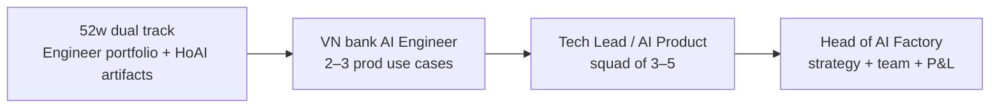

# Head of AI Track (Track B)

**Profile:** Banking BA/domain expert · learning Python · target **Head of AI Factory** (3–5 year horizon)  
**Time:** **2 hours/week** alongside **8 hours** technical track (52 weeks)  
**Technical track:** AI Engineer first → Lead → Head of AI  
**Delivery playbook:** [track-b-delivery.md](track-b-delivery.md) · outputs → `lab/delivery/track-b/`

---

## Why two tracks?

| Track A (8h) | Track B (2h) |
|--------------|--------------|
| Code, models, agents, deploy | Strategy, value case, governance, org |
| Proves you can **ship** | Proves you can **lead an AI Factory** |
| OCB / NAB AI Engineer interviews | Future C-level / HoAI conversations |

Your unfair advantage: **BRD + compliance + banking KPI language** — Track B makes that visible in artifacts, not only in conversation.

---

## Five leadership milestones (H0–H4)

| ID | Week | Deliverable | Template |
|----|------|-------------|----------|
| **H0** | 8 | AI strategy on one page | [week08_ai_strategy.md](templates/hoai/week08_ai_strategy.md) |
| **H1** | 16 | PD model value case (VND/bps) | [week16_pd_value_case.md](templates/hoai/week16_pd_value_case.md) |
| **H2** | 28 | Copilot G1/G2/G3 governance | [week28_copilot_governance.md](templates/hoai/week28_copilot_governance.md) |
| **H3** | 40 | 90-day AI Factory plan | [week40_ninety_day_plan.md](templates/hoai/week40_ninety_day_plan.md) |
| **H4** | 52 | 5-slide steering deck | [week52_steering_deck.md](templates/hoai/week52_steering_deck.md) · VPBank variant: [vpbank_steering_one_pager.md](templates/hoai/vpbank_steering_one_pager.md) |

Mark complete in the **Learning app → Leadership tab** on each milestone week. Save filled docs to **`lab/delivery/track-b/`** ([delivery playbook](track-b-delivery.md)).

---

## Career arc (realistic)



Apply **AI Engineer / Senior BA AI** after Year 1 — not Head of AI yet. Use Track B deck in **internal** steering or **second-round** leadership conversations.

---

## Weekly rhythm

```
Session (10h total)
├── 8h Track A — read · type · lab · commit
└── 2h Track B — read strategy/governance doc · fill template · 2-min exec readout
```

Rule: **Same day as Track A** — leadership without shipping code is slides-only; code without value case is hobby.

---

## Core reading (Track B)

| When | Document |
|------|----------|
| Week 8+ | [archive/head-of-ai-factory/strategy-and-roadmap.md](../archive/head-of-ai-factory/strategy-and-roadmap.md) |
| Week 28+ | [governance-mlops.md](governance-mlops.md) |
| Week 41+ | [job-skills-adaptation.md](job-skills-adaptation.md) |
| Example | [ai-factory-demo-case.md](ai-factory-demo-case.md) |
| Portfolio | [project-adaptation.md](project-adaptation.md) |
| Slides | `exports/learning/Learning-Track-B-Slides.pptx` (regenerate: `python3 curriculum/generate_track_b_slides.py`) |
| **Interactive canvas** | Cursor: `head-of-ai-factory.canvas.tsx` — 10-slide HoAI deck with charts, factory DAG, VPBank JD map |

---

## Portfolio = mini AI Factory

| Factory stage | Your repo |
|---------------|-----------|
| Intake | [apps/brd/](../apps/brd/) — BRD gate ≥80% |
| Build | `lab/projects/credit-pd-model`, `policy-rag`, `policy-copilot-agent` |
| Govern | Week 28 checklist + [governance-mlops.md](governance-mlops.md) |
| Operate | Eval CI weeks 39–40 |
| Value | Week 16 value case + [ai-factory-demo-case.md](ai-factory-demo-case.md) |

Interview line: *“This repo is an operating model, not homework.”*

---

## Optional depth (1h/month)

- NIST AI RMF executive summary
- EU AI Act high-risk checklist (credit scoring)
- [archive/head-of-ai-factory/interview-kit.md](../archive/head-of-ai-factory/interview-kit.md) — **reverse role**: write 5 questions *you* would ask an AI Engineer hire

---

## Regenerate app data

After editing `learning_data.py`:

```bash
python3 curriculum/generate_all_learning.py
# or export only:
python3 -c "import sys; sys.path.insert(0,'curriculum'); from learning_loader import export_json; export_json()"
```
