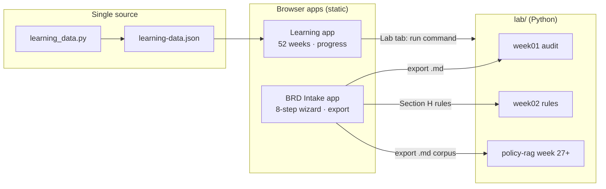

# Project Adaptation — Understand the Apps & Your Learning Path

**For:** Banking domain expert · zero Python · target: AI engineer / Senior BA (OCB, NAB, VPBank)  
**Map:** [.agent/PROJECT.md](../.agent/PROJECT.md) · **Live:** [Learning app](https://taiphan.github.io/learning/) · [BRD app](https://taiphan.github.io/learning/brd/)

---

## Three apps — one learning system



| App | Path | You use it to |
|-----|------|----------------|
| **Learning app** | `apps/learning/` | Navigate weeks, track progress, copy run commands, **Track B leadership milestones** |
| **BRD Intake app** | `apps/brd/` | Practice BRD writing; export markdown for Python + RAG |
| **Learning lab** | `lab/` | Run exercises in Cursor terminal |

**Live (GitHub Pages):** Learning `/` · BRD `/brd/` · Repo [github.com/taiphan/learning](https://github.com/taiphan/learning)

**Local:**

```bash
# Terminal 1 — learning cockpit
cd apps/learning && python3 -m http.server 8081

# Terminal 2 — BRD practice (optional)
cd apps/brd && python3 -m http.server 8080
```

---

## Layer 1 — Learning BRD Intake (`apps/brd/`)

### What it does

Static **8-step wizard** — no backend, drafts in `localStorage` (`learning-brd-draft`):

```
Request → Summary → Objectives → Current → To-be → Rules → Compliance → Acceptance
```

| Feature | Where | Business meaning |
|---------|-------|------------------|
| Quality score 0–100% | `app.js` → `computeScore` | Weights from `learning.js` · gate ≥ 80% |
| Risk badge | `computeRiskLevel` | Low → Critical from compliance flags |
| Request classifier | `getRequestTypeMeta` | Access/incidents → Service Desk, not BRD |
| Stakeholder routing | `computeRouting` | IT-Governance, IT-Security, GRC/Legal |
| Export markdown | `exportBRD` | Sections `## B.` … `## M.` — feeds Week 1 Python |
| VI / EN | `i18n` | Toggle without reload |

### Export sections ↔ Python audit (Week 1)

| BRD export header | Python `brd_utils.MANDATORY_SECTIONS` |
|-------------------|----------------------------------------|
| `## B. EXECUTIVE SUMMARY` | `EXECUTIVE SUMMARY` |
| `## C. OBJECTIVES & KPIs` | `OBJECTIVES` |
| `## E. TO-BE & SCOPE` | `SCOPE` |
| `## H. BUSINESS RULES` | `BUSINESS RULES` |
| `## M. ACCEPTANCE CRITERIA` | `ACCEPTANCE CRITERIA` |

The web app scores **more** sections (A–O); Week 1 exercise checks the **five mandatory** gates above.

### Configuration — edit `apps/brd/config/learning.js` only

| Config block | Change when |
|--------------|-------------|
| `businessUnits`, `applications`, `products` | Another bank or pilot systems |
| `scoreWeights` / `scoreSections` | Only with matching update to `docs/05-brd-quality-checklist.md` |
| `requestTypes` | BRD vs Service Desk buckets |
| `complianceQuestions` | Security/GRC routing |

**Learning adaptation added:** `policy_copilot` application — draft a BRD for your future RAG copilot (Weeks 25–33 portfolio).

---

## Layer 2 — Learning app (`apps/learning/`)

### What it does

| Tab | Content |
|-----|---------|
| **Overview** | Objectives, deliverable, skill context, week-specific “bridge” tips |
| **Study** | Reading list, sources, clickable resource URLs |
| **Lab** | Exercise path, run command (copy), done-when checklist |
| **Notes** | Your notes — saved in browser (`learning-ai-learning-progress`) |

Data loads from `learning-data.json` (generated from `learning_data.py`).

**Week bridges built in:**

- **Week 1** → link to BRD app + `week01_brd_checklist.py` on your export
- **Week 2** → link to `examples/04a-brd-pos-lending.md` business rules
- **Weeks 25–33** → use BRD exports as RAG corpus

---

## Layer 3 — Learning lab (`lab/`)

| Week | File | Connects to |
|------|------|-------------|
| 1 | `exercises/week01_brd_checklist.py` | BRD export markdown |
| 2 | `exercises/week02_loan_rules.py` | POS lending rules (15M / 40% DTI / 12 mo / 100M) |
| 3–4 | `week03`, `week04` + `lib/brd_utils.py` | Weighted score + scorecard class |
| 5–7 | `sql/week05–07` + `setup_db.py` | Analytics on sample loans |
| 25+ | `week25_rag_cli.py`, `projects/policy-rag/` | Policy text + your BRD exports |

Shared libs: `lib/brd_utils.py`, `lib/loan_utils.py`, `lib/rag_simple.py`

---

## How to adapt for YOUR journey (not Finance rollout)

### Adaptation A — Week 1 loop (do this first)

1. Open [learning app](https://taiphan.github.io/learning/) → Week 1 → **Lab**
2. Open [BRD app](https://taiphan.github.io/learning/brd/) → fill minimal BRD → **Export .md**
3. From `lab/`:
   ```bash
   python3 exercises/week01_brd_checklist.py ~/Downloads/your-export.md
   ```
4. Fix missing sections in BRD app → re-export until audit passes

**Interview line:** *“I automated the same quality gate as our intake app.”*

### Adaptation B — Week 2 rules from domain

Run `week02_loan_rules.py` — same thresholds as `examples/04a-brd-pos-lending.md` Section H.

**Interview line:** *“I turned BRD business rules into executable policy code.”*

### Adaptation C — Draft your AI copilot BRD (Weeks 4–24)

1. In BRD app, select application **AI Policy Copilot (learning pilot)**
2. Write problem/KPIs/rules for branch staff policy lookup
3. Export → save under `lab/data/` or use in Week 27 `policy-rag/ask.py`

### Adaptation D — Portfolio arc (Months 6–12)

| Phase | Project | Uses from this repo |
|-------|---------|---------------------|
| ML | `credit-pd-model/` | `sample_loans.csv` |
| RAG | `policy-rag/` | Your BRD exports + `sample_policy.txt` |
| Agent | `policy-copilot-agent/` | Same policy chunks + escalation |
| API | `week33_fastapi/` | FastAPI `/ask` like a mini production copilot |
| Career | `week41_value_case.md` | KPI pattern from sample BRDs |

---

## What NOT to change (yet)

| Avoid | Do instead |
|-------|------------|
| Rewrite `app.js` before Week 4 Python | Complete week01–02 first |
| Change score weights without updating `docs/05` | Keep config and checklist aligned |
| Put API keys in `learning.js` | `.env` in separate AI repos only |
| Skip the 80% export gate in the app | Same discipline as real BA intake |

---

## Track B — Head of AI (2h/week alongside 8h technical)

Aligned to **Y1 quarters** — leadership milestones land on career gates, not random weeks.

| Quarter | Week | Track B | Career gate |
|---------|------|---------|-------------|
| Y1 Q1 | 8 | H0 AI strategy | Technologist |
| Y1 Q2 | 16 | H1 PD value case | ML hire signal |
| Y1 Q3 | 28 | H2 governance | GenAI production |
| Y1 Q4 | 40 | H3 90-day plan | Apply prep |
| Y1 Q4 | 52 | H4 steering deck | Graduate + leadership narrative |

**Guide:** [head-of-ai-track.md](head-of-ai-track.md) · **Demo case:** [ai-factory-demo-case.md](ai-factory-demo-case.md)

In the learning app: open weeks 8 / 16 / 28 / 40 / 52 → **Leadership** tab → fill template → save to `lab/delivery/track-b/` → check **Track B complete**.

**Delivery playbook:** [track-b-delivery.md](track-b-delivery.md)

---

## Regenerate after curriculum edits

```bash
python3 curriculum/generate_all_learning.py
# Updates: learning-data.json, lab, slides, apps/learning copy of JSON
# Deploy: git push origin main → GitHub Pages
```

---

## Your next 3 actions

1. **Today:** Learning app Week 1 → BRD app export → `week01_brd_checklist.py` on your file  
2. **This week:** Week 2 loan rules + mark weeks complete in learning app  
3. **This month:** Pass CP0 (Week 4) — 50-line Python + GitHub repo before any ML content  

See also: [ai-skills-workbook.md](ai-skills-workbook.md) · [reading-path.md](reading-path.md) · [job-skills-adaptation.md](job-skills-adaptation.md)
