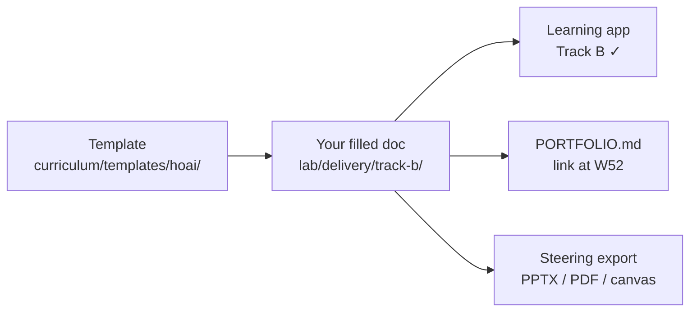

# Track B Delivery Playbook

**What this is:** How to **deliver** each Head of AI milestone (H0–H4) in ~2 hours/week — where files go, what “done” means, and what you ship at Week 52.

**Who:** Banking BA · dual track · target AI Engineer (Y1) → Head of AI (Y4–5)  
**App:** Learning → **Leadership** tab on weeks **8, 16, 28, 40, 52** · checkbox **Track B complete**

---

## Delivery model



| Step | Action | Time |
|------|--------|------|
| 1 | Finish **Track A lab** for that week first | 8h (same week) |
| 2 | Open **Leadership** tab → read `study` links | 15 min |
| 3 | Copy template → fill → save to **delivery path** below | 75 min |
| 4 | 2-min exec readout ( aloud or Loom ) | 10 min |
| 5 | Check **Mark Track B milestone complete** in app | 1 min |

**Rule:** No Track B-only weeks — leadership artifacts must reference **something you shipped** in Track A (even Week 8 = BRD gate + Python checklist).

---

## Delivery folder (canonical outputs)

Save completed work here (commit to your fork or personal repo):

```
lab/delivery/track-b/
├── README.md
├── h0-ai-strategy.md          ← Week 8
├── h1-pd-value-case.md        ← Week 16
├── h2-copilot-governance.md   ← Week 28
├── h3-ninety-day-plan.md      ← Week 40
├── h4-steering-deck.md        ← Week 52 (script + slide outline)
└── exports/
    ├── h4-steering.pdf          ← optional: exported deck
    └── h4-steering.pptx         ← optional: from Learning-Track-B-Slides
```

Copy starter:

```bash
cp curriculum/templates/hoai/week08_ai_strategy.md lab/delivery/track-b/h0-ai-strategy.md
# repeat for h1–h4 templates at each milestone week
```

---

## Milestone delivery schedule

| ID | Week | Deliverable file | Template | Track A dependency |
|----|------|------------------|----------|-------------------|
| **H0** | 8 | `h0-ai-strategy.md` | [week08_ai_strategy.md](templates/hoai/week08_ai_strategy.md) | CP1 · pandas/SQL · BRD app |
| **H1** | 16 | `h1-pd-value-case.md` | [week16_pd_value_case.md](templates/hoai/week16_pd_value_case.md) | CP2 · `credit-pd-model` metrics |
| **H2** | 28 | `h2-copilot-governance.md` | [week28_copilot_governance.md](templates/hoai/week28_copilot_governance.md) | CP3 · `policy-rag` grounded answers |
| **H3** | 40 | `h3-ninety-day-plan.md` | [week40_ninety_day_plan.md](templates/hoai/week40_ninety_day_plan.md) | CP5 · Docker API live |
| **H4** | 52 | `h4-steering-deck.md` + export | [week52_steering_deck.md](templates/hoai/week52_steering_deck.md) · [VPBank variant](templates/hoai/vpbank_steering_one_pager.md) | Full portfolio · all CPs |

---

## Done criteria (quality gate per milestone)

### H0 — AI strategy (Week 8)

- [ ] Five pillars each have **measurable** first-year outcome
- [ ] Operating model lists 5 steps tied to **apps/brd** + lab
- [ ] ≥1 use case names a **repo path** you will build
- [ ] ≤500 words or 1 slide
- [ ] Saved: `lab/delivery/track-b/h0-ai-strategy.md`

### H1 — PD value case (Week 16)

- [ ] Problem stated in **VND or bps NPL**, not model jargon
- [ ] Baseline vs target table filled (rough estimates OK)
- [ ] AUC from `credit-pd-model` cited
- [ ] One SHAP sentence an exec would repeat
- [ ] Saved: `lab/delivery/track-b/h1-pd-value-case.md`

### H2 — Copilot governance (Week 28)

- [ ] Risk tier chosen (G1/G2/G3) with rationale
- [ ] G1/G2/G3 gates each have owner + evidence path
- [ ] Links to `policy-rag` or copilot + eval week
- [ ] Saved: `lab/delivery/track-b/h2-copilot-governance.md`

### H3 — 90-day plan (Week 40)

- [ ] Three phases 0–30 / 30–60 / 60–90 with dated outputs
- [ ] References **H0** strategy + **H2** governance by name
- [ ] Headcount or squad sketch (even hypothetical)
- [ ] Saved: `lab/delivery/track-b/h3-ninety-day-plan.md`

### H4 — Steering deck (Week 52)

- [ ] 5 slides: strategy · portfolio · KPIs · 90-day · ask
- [ ] Metrics from **your** lab (not template placeholders)
- [ ] 5-min script rehearsed or recorded
- [ ] VPBank prep: use [vpbank_steering_one_pager.md](templates/hoai/vpbank_steering_one_pager.md)
- [ ] Saved: `lab/delivery/track-b/h4-steering-deck.md` + optional PDF/PPTX in `exports/`
- [ ] Linked from [lab/projects/PORTFOLIO.md](../lab/projects/PORTFOLIO.md)

---

## Year 1 delivery bundle (what you show)

At Week 52 you should be able to open **one folder** and demo:

| Audience | Package |
|----------|---------|
| **AI Engineer interview** | Track A repos + H1 value case (proves business lens) |
| **Senior BA + AI** | BRD app + H0 strategy + H2 governance |
| **Leadership second round** | H4 deck + [Learning-Track-B-Slides.pptx](../exports/learning/Learning-Track-B-Slides.pptx) + canvas rehearsal |
| **Internal steering (practice)** | H3 90-day plan + H4 ask slide |

**Do not** send H4 deck to VPBank HoAI posting as a job application in Year 1 — use for internal rehearsal and leadership loops only ([§F.4](job-skills-adaptation.md#f4-vpbank--head-of-ai-factory-stretch--track-b)).

---

## Visual & slide assets

| Asset | Use when |
|-------|----------|
| [Learning-Track-B-Slides.pptx](../exports/learning/Learning-Track-B-Slides.pptx) | Export/share; regenerate: `python3 curriculum/generate_track_b_slides.py` |
| Cursor canvas `head-of-ai-factory.canvas.tsx` | Rehearse 10-slide narrative beside chat |
| [ai-factory-demo-case.md](ai-factory-demo-case.md) | Example filled policy copilot scenario for H2/H4 |

---

## App & progress tracking

| Signal | Where |
|--------|-------|
| Track B milestones | Top bar **B 0/5** · sidebar **Head of AI (Track B)** |
| Per-week instructions | Week **Leadership** tab |
| Technical progress | **Mark week complete** (separate from Track B) |

`trackBCompleted` in browser localStorage — not synced across devices; your **git commits** in `lab/delivery/track-b/` are the source of truth.

---

## 2-hour session script (any milestone week)

```
0:00  Open Leadership tab · skim template + delivery path
0:15  Read linked doc (strategy archive / governance / demo case)
0:30  Fill tables — use Track A metrics where required
1:15  Cut to one page · check done criteria above
1:45  Read aloud 2-min exec summary
1:55  Save file · git commit · check Track B complete in app
```

---

## Related

- [head-of-ai-track.md](head-of-ai-track.md) — career arc & reading
- [project-adaptation.md](project-adaptation.md) — three-app workflow
- [job-skills-adaptation.md](job-skills-adaptation.md) §F.4 — VPBank HoAI map
