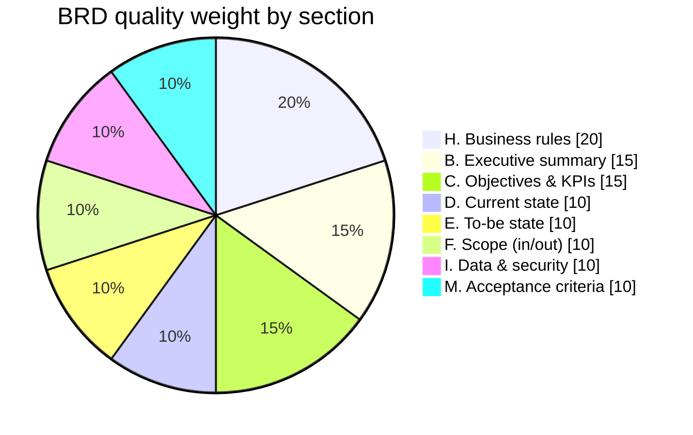

# FE Credit BRD Quality Checklist & Scoring Rubric

Use this checklist for **self-review** (business user), **BA quality review**, and **training certification**.

**Pass gate:** Total score ≥ **80%** AND Business Sponsor sign-off AND all mandatory sections complete.

---

## Part 1 — Mandatory completeness (pass/fail)

All must be ☑ before scoring.

| # | Item | ☐ |
|---|------|---|
| 1 | BRD title and ID assigned | |
| 2 | Business unit and requester identified | |
| 3 | Business Sponsor (Director+) named | |
| 4 | Executive summary completed | |
| 5 | At least 1 objective with baseline, target, measurement | |
| 6 | Current process documented | |
| 7 | To-be state described (business view) | |
| 8 | In scope AND out of scope written | |
| 9 | Users/stakeholders table completed | |
| 10 | Business rules section completed (or N/A justified) | |
| 11 | Data classification identified | |
| 12 | Minimum 5 acceptance criteria (Given/When/Then) | |
| 13 | Compliance screening (Section N) completed | |
| 14 | Sponsor signature / approval | |

**If any unchecked:** return to requester — do not score.

---

## Part 2 — Quality scoring (0 / 1 / 2 per section)

| Score | Definition |
|------:|------------|
| **0** | Missing or unusable |
| **1** | Present but vague; IT would need to guess |
| **2** | Clear, testable, complete |

| Section | Weight | Score (0-2) | Weighted |
|---------|--------|-------------|----------|
| B. Executive summary | 15% | | |
| C. Objectives & KPIs | 15% | | |
| D. Current state | 10% | | |
| E. To-be state | 10% | | |
| F. Scope (in/out) | 10% | | |
| H. Business rules | 20% | | |
| I. Data & security | 10% | | |
| M. Acceptance criteria | 10% | | |
| **Total** | **100%** | | **___%** |

**Section weight distribution:**



**Scoring guide:**
- 0 on business rules usually fails the BRD (max 70% even if other sections perfect)
- Objectives without baseline = score 1 max on Section C
- Technical solution instead of business need = score 0 on Section E

---

## Part 3 — Red flag review (auto-escalate)

| Red flag | Action |
|----------|--------|
| Personal device / BYOD for customer data | Security review mandatory |
| Personal cloud (Dropbox, personal Gmail) | Reject or rewrite |
| "Disable MFA / DLP" | Reject |
| No sponsor | Return immediately |
| Multiple unrelated projects in one BRD | Split required |
| No out-of-scope | Return with coaching |
| Changes interest/fees/contract without Legal | Legal review mandatory |
| Collections/legal process change | Compliance review mandatory |

---

## Part 4 — BA review feedback template

```text
BRD ID:
Reviewer:
Date:
Score: ___%
Decision: ☐ Accept to IT triage  ☐ Return for revision  ☐ Reject

Gaps (specific sections):
1.
2.
3.

Required before resubmit:
-

Risk/Compliance needed: ☐ Yes ☐ No
Security needed: ☐ Yes ☐ No
Legal needed: ☐ Yes ☐ No
```

---

## Part 5 — Certification (training program)

**BRD Ready — FE Credit** awarded when:
- Attended all 4 training sessions
- Submitted 1 real BRD scoring ≥ 80%
- Sponsor sign-off obtained
- BA coach confirms readiness

---

*Checklist v1.0 | FE Credit BRD Training Package*
