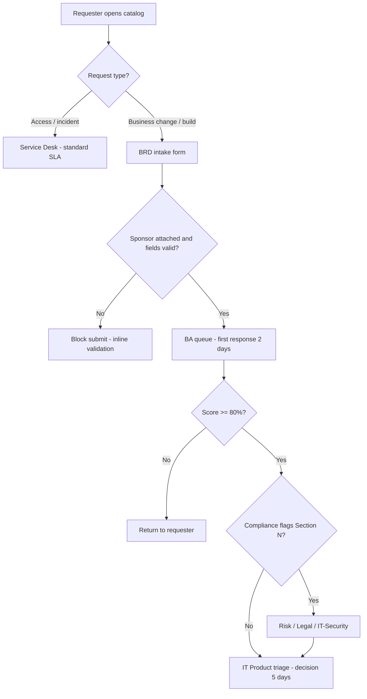

# ServiceNow / Jira BRD Intake Form — Field Mapping

Use this document to configure your ITSM tool (ServiceNow, Jira Service Management, or similar) so business users submit structured BRDs before BA review.

---

## 1. Recommended catalog item / request type

| Setting | Value |
|---------|-------|
| **Name** | Submit Business Requirements Document (BRD) |
| **Category** | IT / Digital / Business Applications |
| **Fulfillment group** | Business Analysis (BA) Team |
| **SLA — first response** | 2 business days |
| **SLA — triage decision** | 5 business days |
| **Prerequisite** | Business Sponsor approval attachment required |

### Intake routing flow



---

## 2. Form fields → BRD template mapping

| # | Form field (UI label) | Field type | Mandatory | Maps to BRD section | Validation / notes |
|---|----------------------|------------|-----------|----------------------|-------------------|
| 1 | BRD Title | Single line text | Yes | A | Max 120 chars |
| 2 | Business Unit | Dropdown | Yes | A | Digital & CX, Sales/POS, Credit & Risk, Collections, Cards, Customer Service, Operations, Finance, HR, Other |
| 3 | Requester | User lookup | Yes | A | Auto-populated |
| 4 | Requester Email | Email | Yes | A | Auto-populated |
| 5 | Business Sponsor | User lookup | Yes | A | Must be Director+ (manual or HR validation) |
| 6 | Target Go-Live Date | Date | Yes | A | Must be ≥ 15 business days from submit |
| 7 | Priority Category | Dropdown | Yes | A | Regulatory, Revenue, CX, Efficiency, Risk Reduction, Other |
| 8 | Regulatory Deadline | Date | No | A | Required if Priority = Regulatory |
| 9 | Executive Summary — Problem | Multi-line | Yes | B | Min 50 chars |
| 10 | Executive Summary — Impact | Multi-line | Yes | B | Encourage metrics |
| 11 | Desired Business Outcome | Single line | Yes | B | One sentence |
| 12 | Objectives & KPIs | Multi-line / repeating | Yes | C | Min 1 objective with baseline + target |
| 13 | Current Process | Multi-line | Yes | D | Step-by-step |
| 14 | Current Systems | Multi-select | Yes | D | FE ONLINE 2.0, POS/LOS, Finacle LMS, Finacle CIF, Finacle Assure, FirstVision, Collections, CRM, Chatbot, eSign, Workflow, BI, SMS gateway, Other — see [landscape](00-fe-credit-application-landscape.md) |
| 15 | Volume — Users affected | Number | Yes | D | > 0 |
| 16 | Volume — Transactions/month | Number | No | D | |
| 17 | To-Be Process Description | Multi-line | Yes | E | Block technical keywords* |
| 18 | In Scope | Multi-line | Yes | F | |
| 19 | Out of Scope | Multi-line | Yes | F | |
| 20 | Assumptions | Multi-line | No | F | |
| 21 | Dependencies | Multi-line | No | F | |
| 22 | Stakeholders Table | Attachment or repeating | Yes | G | Role, dept, # users, location |
| 23 | Business Rules | Multi-line | Yes** | H | **Mandatory for lending/collections/cards |
| 24 | Data Types | Multi-select | Yes | I | PII, Financial, CIC, Payment, Employee, Other |
| 25 | Data Classification | Dropdown | Yes | I | Public, Internal, Confidential, Restricted |
| 26 | Remote / Home Access | Dropdown | Yes | I | None, Managed device, VDI required, Exception needed |
| 27 | Customer Consent Required | Yes/No | Yes | I | |
| 28 | Reports Required | Multi-line | No | J | |
| 29 | Controls / Maker-Checker | Multi-line | No | J | |
| 30 | Rollout Approach | Dropdown | Yes | K | Pilot, Phased, Big bang |
| 31 | Pilot Region (if Pilot) | Text | Conditional | K | |
| 32 | Training Required | Yes/No | Yes | K | |
| 33 | Language | Multi-select | Yes | K | Vietnamese, English, Bilingual |
| 34 | Risks if Wrong | Multi-line | Yes | L | |
| 35 | Acceptance Criteria | Multi-line | Yes | M | Min 5 lines; Given/When/Then |
| 36 | Compliance Q1 — Origination change | Yes/No/NA | Yes | N | |
| 37 | Compliance Q2 — Interest/fees/contract | Yes/No/NA | Yes | N | |
| 38 | Compliance Q3 — Customer notifications | Yes/No/NA | Yes | N | |
| 39 | Compliance Q4 — Third-party data | Yes/No/NA | Yes | N | |
| 40 | Compliance Q5 — Collections/legal | Yes/No/NA | Yes | N | |
| 41 | Compliance Q6 — Audit trail | Yes/No/NA | Yes | N | |
| 42 | Compliance Q7 — POS/field data exposure | Yes/No/NA | Yes | N | |
| 43 | Full BRD Document | Attachment | Yes | All | PDF or Word; template-based |
| 44 | Process Diagram | Attachment | No | E | Visio, draw.io, PNG |
| 45 | Sponsor Approval Email | Attachment | Yes | O | Or e-signature |
| 46 | Related BRD / Project ID | Text | No | A | |

\*Optional automation: flag if To-Be contains "API", "Kafka", "database", "AWS", "microservice" → BA coaching tip (not auto-reject).

---

## 3. Auto-routing rules

| Condition | Route to | SLA |
|-----------|----------|-----|
| Any Compliance Q = Yes | Risk / Compliance queue | +3 business days |
| Data Classification = Restricted | Security Architecture | Parallel review |
| Remote access = Exception needed | Security | Parallel review |
| Compliance Q2 = Yes (interest/fees/contract) | Legal + Finance | Parallel review |
| Compliance Q4 = Yes (third-party) | Vendor Risk | Parallel review |
| Priority = Regulatory | Expedited triage | 2 business days |
| Business Unit = Collections + Q5 = Yes | Collections Compliance | Parallel |

---

## 4. Workflow states

```text
New → BA Quality Review → Returned for Revision → Resubmitted
                       → Accepted (Score ≥ 80%) → IT Triage
                       → Rejected (with reason)

IT Triage → Approved for FRD → BA creates FRD → Project backlog
          → Deferred (backlog / dependency)
          → Rejected (with reason)
```

| State | Owner | Max duration |
|-------|-------|--------------|
| BA Quality Review | BA Team | 2 business days |
| Returned for Revision | Requester | 10 business days (then auto-close) |
| IT Triage | IT Product / Portfolio | 3 business days |
| Risk/Compliance Review | GRC | 5 business days |

---

## 5. Jira-specific configuration

### Issue type
- **Name:** Business Requirement (BRD)
- **Project:** DIGITAL / ITBM / Service Desk (per your setup)

### Custom fields (Jira field ID — configure locally)

| Jira custom field name | Type | BRD section |
|------------------------|------|-------------|
| BRD Score % | Number | Quality gate |
| Business Sponsor | User picker | A |
| Business Unit | Select list | A |
| Data Classification | Select list | I |
| Compliance Review Required | Checkbox (auto) | N |
| Security Review Required | Checkbox (auto) | I |
| Acceptance Criteria | Paragraph | M |
| Business Rules | Paragraph | H |

### Automation rules (Jira Automation)

1. **If** any of Compliance Q1–Q7 = Yes **→** set `Compliance Review Required` = true **→** add label `needs-compliance`
2. **If** Data Classification = Restricted **→** set `Security Review Required` = true
3. **If** BRD Score < 80 **→** transition to "Returned for Revision" with comment template
4. **On transition** to "Accepted" **→** notify IT Portfolio Manager

---

## 6. ServiceNow-specific configuration

### Catalog item variables
Map form fields above to ServiceNow variables (`u_brd_*` naming convention).

### Flow Designer flow (simplified)

```text
1. Submit BRD request
2. Validate mandatory attachments (BRD doc + sponsor approval)
3. Assignment: BA Group
4. BA runs quality checklist → updates u_brd_score
5. If score < 80 → Return to requester task
6. If score ≥ 80 → Parallel approval (if compliance flags)
7. Create demand / project in SPM (optional)
8. Close request with triage outcome
```

### Integration
- Attach BRD PDF to **SPM Demand** record
- Link to **CMDB** application CI if system known

---

## 7. Notification templates

### To requester — returned for revision
> Your BRD [BRD-ID] requires revision before IT triage.  
> Score: [X]%. Required gaps: [list].  
> Please update sections [sections] and resubmit within 10 business days.

### To requester — accepted to triage
> Your BRD [BRD-ID] passed quality review (score [X]%).  
> It is now in IT triage. Expected decision within 5 business days.

### To Risk — compliance review
> BRD [BRD-ID] triggered compliance review.  
> Flags: [list]. Business Unit: [unit]. Target go-live: [date].

---

## 8. Reporting / dashboards

| Metric | Source | Audience |
|--------|--------|----------|
| BRD first-pass acceptance rate | BRD Score ≥ 80 on first submit | BA Lead |
| Avg days BRD → triage decision | Workflow timestamps | IT PMO |
| % BRDs with compliance routing | Auto-routing flags | CISO / GRC |
| Top return reasons | BA gap comments | Training program |
| BRDs by business unit | Form field | Leadership |

---

## 9. Implementation checklist

- [ ] Create catalog item / Jira issue type
- [ ] Configure all 46 fields per table above
- [ ] Upload BRD template as downloadable attachment on form
- [ ] Configure auto-routing for compliance flags
- [ ] Configure SLA and notifications
- [ ] Pilot with Digital team for 2 weeks
- [ ] Enforce gate: no FRD without accepted BRD
- [ ] Train Service Desk not to accept informal email requests for projects

---

*Field mapping v1.0 | FE Credit BRD Training Package*
