# 8-Week BRD Training & Governance Rollout Plan

Program to train Finance business users and enforce BRD quality gate.

---

## Goals

| Goal | Target (by Week 8) |
|------|-------------------|
| BRD first-pass acceptance rate | ≥ 60% |
| Avg BRD rework cycles | < 2 |
| BRD → triage decision time | < 5 business days |
| Projects with sponsor sign-off at intake | 100% |
| Business units trained | Sales/POS, Digital, Collections, Ops |

---

## Rollout timeline (8 weeks)

```mermaid
gantt
  title Finance BRD rollout — 8 weeks
  dateFormat  X
  axisFormat  W%s
  section Setup
  Foundation (templates, BA coaches)      :a1, 0, 1
  Tooling & communications                :a2, 1, 1
  section Training
  Sessions 1-2 (Digital, Sales/POS)       :b1, 2, 2
  Sessions 3-4 (Collections, Ops)         :b2, 4, 2
  section Gates
  Soft gate (form required)               :c1, 6, 1
  Hard gate (no FRD without BRD)          :milestone, 7, 0
  Stabilize & measure                     :c2, 7, 1
```

---

## Week-by-week plan

### Week 1 — Foundation
| Day | Activity | Owner | Deliverable |
|-----|----------|-------|-------------|
| Mon | Approve program charter and RACI | IT + BA Lead | Signed charter |
| Tue | Publish Confluence space | BA Team | FECBRD live |
| Wed | Upload templates and samples | BA Team | Templates on Confluence |
| Thu | Train BA coaches (4h workshop) | BA Lead | Coaches certified |
| Fri | Configure ServiceNow/Jira form (draft) | ITSM Admin | Form in UAT |

**Exit criteria:** Templates live; 6+ BA coaches ready.

---

### Week 2 — Tooling & communications
| Activity | Owner |
|----------|-------|
| Complete ServiceNow/Jira field mapping and routing | ITSM + BA |
| Leadership email: BRD gate effective Week 8 | Sponsor (IT Director) |
| Identify pilot cohort: Digital (30 users) | Digital BU Head |
| Print cheat sheets (VI/EN) | BA / Admin |
| Generate Word/PPT exports | BA Team |

**Exit criteria:** ITSM form in UAT; pilot list confirmed.

---

### Week 3 — Training Session 1 & 2 (Digital + Product)
| Session | Audience | Duration |
|---------|----------|----------|
| Session 1 | Digital, Product | 2h |
| Session 2 | Digital, Product | 3h |

**Homework:** Draft BRD for one real Digital use case.

---

### Week 4 — Training Session 1 & 2 (Sales / POS)
| Session | Audience | Duration |
|---------|----------|----------|
| Session 1 | Sales, POS ops (bilingual materials) | 2h |
| Session 2 | Sales, POS ops | 3h |

**Note:** Use bilingual template and POS sample BRD.

---

### Week 5 — Training Session 3 & 4
| Session | Audience | Duration |
|---------|----------|----------|
| Session 3 — Compliance | All trained units | 2h |
| Session 4 — Workshop | All trained units | 3h |

**Risk/Compliance** co-delivers Session 3.  
Session 4: peer review + certification.

**Exit criteria:** ≥ 40 users achieve BRD Ready certification.

---

### Week 6 — Collections + Operations
| Activity | Owner |
|----------|-------|
| Session 1–2 for Collections | BA + Collections sponsor |
| Session 1–2 for Operations | BA + Ops sponsor |
| Session 3 recap (recorded) for absent staff | BA |
| ITSM form → production | ITSM Admin |

---

### Week 7 — Soft gate
| Rule | Detail |
|------|--------|
| New project requests | Must use BRD form |
| BA review | Score recorded on all submissions |
| Informal email requests | Redirect to form (Service Desk script) |
| Office hours | BA 2h weekly open clinic |

**Monitor:** first-pass rate, return reasons, SLA.

---

### Week 8 — Hard gate & retrospective
| Rule | Detail |
|------|--------|
| **Hard gate** | No FRD / no project charter without BRD score ≥ 80% |
| Retrospective | BA + pilot BUs + Risk |
| Update templates | From top 5 return reasons |
| Leadership dashboard | First metrics report |

---

## RACI

| Activity | Business | BA | IT | Risk | Legal | ITSM |
|----------|----------|-----|-----|------|-------|------|
| Write BRD | R | C | I | I | I | I |
| Quality review | I | R | I | C | C | I |
| IT triage | I | C | R | C | C | I |
| Training delivery | C | R | C | C | C | I |
| Tool configuration | I | C | C | I | I | R |
| Enforce gate | A | R | R | C | C | I |

*R=Responsible, A=Accountable, C=Consulted, I=Informed*

---

## Communication plan

| Week | Message | Channel |
|------|---------|---------|
| 1 | Program launch — why BRD matters | All-hands email |
| 2 | Templates and Confluence link | Intranet |
| 3–6 | Training invites by BU | Calendar |
| 7 | Soft gate reminder | Manager briefing |
| 8 | Hard gate effective | Leadership + Service Desk |

---

## Success metrics (report monthly)

| Metric | Formula |
|--------|---------|
| First-pass acceptance | BRDs ≥80% on first submit / total submitted |
| Rework cycles | Avg count of return→resubmit per BRD |
| Time to triage | Days from accept to IT decision |
| Training coverage | Certified / target headcount |
| UAT defects from unclear reqs | Defects tagged "requirements" / total UAT defects |

---

## Risks and mitigations

| Risk | Mitigation |
|------|------------|
| Low attendance (POS field) | Record Session 1–3; regional champions |
| Resistance — "too much paperwork" | Show sample BRD; emphasize faster delivery |
| BA bottleneck | Coach model; self-checklist before submit |
| Tool delays | Use Confluence + email interim in Week 7 only |
| Sponsors not signing | Escalation via BU Head; no triage without sign-off |

---

## Post–Week 8 sustainment

- Quarterly BRD refresher (1h) for new hires
- Update gold-standard examples annually
- BA office hours ongoing
- Include BRD quality in vendor/SI onboarding
- Annual review of compliance screening questions

---

*Rollout plan v1.0 | Finance BRD Training Package*
