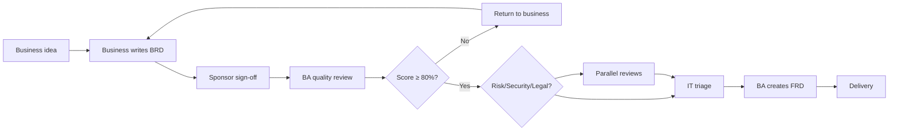

# BRD Governance — RACI & Approval Matrix

Who does what from business idea to FRD at Finance.

---

## End-to-end flow

---

## RACI matrix

| Step | Business Requester | Business Sponsor | BU Head | BA | IT Product | Risk/GRC | Legal | Security | ITSM |
|------|-------------------|------------------|---------|-----|------------|----------|-------|----------|------|
| Identify business need | R | A | I | C | I | I | I | I | I |
| Draft BRD | R | C | I | C | I | I | I | I | I |
| Sponsor approval | C | R/A | I | I | I | I | I | I | I |
| BA quality review | I | I | I | R/A | I | C | C | C | I |
| Compliance screening | C | I | I | R | I | R | C | C | I |
| IT triage / prioritize | I | C | C | C | R/A | C | C | C | I |
| Approve build start | I | C | A | C | R | C | C | C | I |
| Create FRD | C | I | I | R | A | C | C | C | I |
| UAT acceptance | R | A | I | C | C | I | I | I | I |

---

## Approval authority by risk level

| BRD risk level | Criteria | Approvers required |
|----------------|----------|-------------------|
| **Low** | Internal data only; no customer/regulatory change | Sponsor + BA accept |
| **Medium** | Customer data; notifications; operational change | Sponsor + BA + IT Product |
| **High** | Origination/disbursement; collections; third-party data | Sponsor + BA + Risk + IT Product |
| **Critical** | Contract/pricing change; restricted data; security exception | Above + Legal + CISO + BU Head |

### Auto risk level rules

| Trigger | Min risk level |
|---------|----------------|
| Data = Restricted | High |
| Compliance Q2 = Yes (fees/contract) | Critical |
| Compliance Q4 = Yes (third-party) | High |
| Remote access = Exception | High |
| Compliance Q5 = Yes (collections/legal) | High |

---

## Delegation rules

- Sponsor must be **Director grade or above** within requesting BU
- Sponsor cannot be the sole approver for **Critical** BRDs
- BA cannot approve their own BRD as requester (four-eyes)
- IT Product may **defer** but not **reject** business need — rejection requires documented alternative or BU Head agreement

---

## Escalation path

| Situation | Escalate to | Within |
|-----------|-------------|--------|
| BRD returned 2+ times | BU Head + BA Lead | 3 business days |
| Risk review SLA breach | GRC Manager | 2 business days |
| Security exception dispute | CISO office | 5 business days |
| IT triage backlog > 10 days | IT PMO Director | Weekly |
| Regulatory deadline at risk | Program steering committee | Immediate |

---

## Document retention

| Document | Retention | Owner |
|----------|-----------|-------|
| Submitted BRD (all versions) | 7 years | BA / Document mgmt |
| BA scorecard | 7 years | BA |
| Approval emails | 7 years | Requester |
| FRD linked to BRD | Life of system + 7 years | BA + IT |

---

*Governance v1.0 | Finance BRD Training Package*
