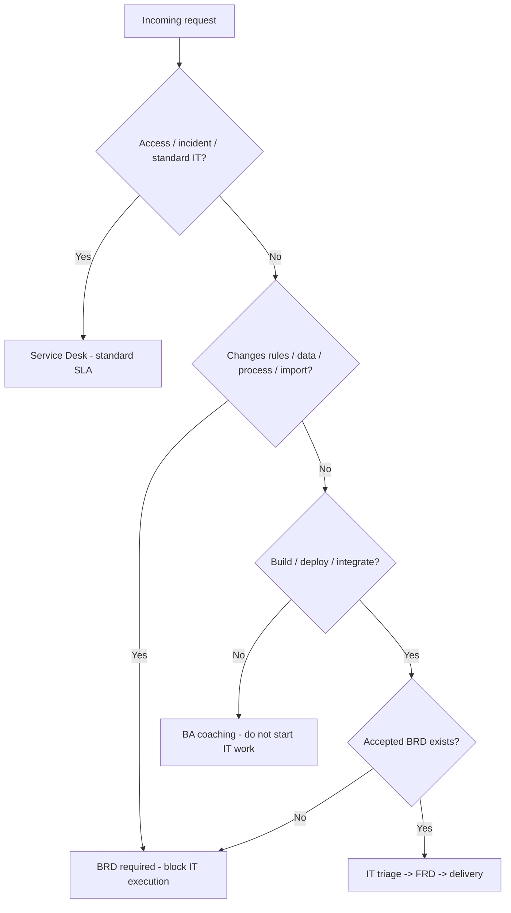

# Operations Manager Checklist — IT Intake, Deployment & Risk Control

Use this checklist to **guide team members**, **reject wrong-bucket work**, and **control deployment** so business users define and own business decisions—not IT.

**Related docs:** [IT Operations Runbook](14-it-operations-runbook.md) · [Governance RACI](10-governance-raci.md) · [BRD quality checklist](05-brd-quality-checklist.md) · [ServiceNow/Jira mapping](07-servicenow-jira-intake-mapping.md) · [Rollout plan](09-rollout-plan-8-weeks.md)

---

## Golden rules

1. **IT executes; business defines.** No build/deploy without accepted BRD (score ≥ 80%) + Sponsor sign-off.
2. **Email/chat are not intake** for projects or business-rule changes.
3. **Data import is a business act**—requires BRD, approved file, and maker-checker—not an IT execution ticket.
4. **UAT sign-off is business-owned**—IT does not accept on behalf of business.

---

## Part 1 — Incoming request triage (every SR / ticket)

Complete before assigning work to IT delivery.

| # | Check | ☐ Pass | ☐ Fail | Action if fail |
|---|------|--------|--------|----------------|
| 1 | Request submitted via **official ITSM catalog** (not email/chat only) | | | Redirect to catalog; log informal intake |
| 2 | Request type identified (see decision tree below) | | | Classify before assign |
| 3 | If **business rule / process / data / import / report definition** → BRD required | | | Block IT execution; open BRD intake |
| 4 | If **build / deploy / integrate** → accepted BRD linked (ID + score ≥ 80%) | | | Return to business: complete BRD first |
| 5 | **Business Sponsor** (Director+) named and approval attached | | | Return immediately |
| 6 | **Acceptance criteria** present (min 5 Given/When/Then) or in linked BRD | | | Return to business |
| 7 | No **technical solution** prescribed by requester (API, DB, vendor design) | | | Coach: rewrite as business problem |
| 8 | Compliance flags reviewed (Section N / auto-routing) | | | Route to Risk/Legal/Security |
| 9 | **Risk level** assigned (Low / Medium / High / Critical) | | | Apply approval matrix |
| 10 | Correct **fulfillment group** (BA vs IT Product vs Service Desk) | | | Reassign |

**Triage decision:** ☐ Proceed to IT  ☐ Redirect to BRD  ☐ Standard ITSM (access/incident)  ☐ Reject with reason

---

## Part 2 — Business bucket vs IT bucket

If **any** row in the Business column applies, **do not** let IT execute. Redirect to BRD.

| Work type | Bucket | Business must provide | IT may do |
|-----------|--------|----------------------|-----------|
| Business rules (approval, cut-off, exceptions) | **Business** | BRD Section H + Sponsor | Coach only |
| Bulk data import / mass update | **Business** | BRD + approved file + maker-checker | Execute import after approvals |
| Report / KPI definition | **Business** | BRD Section J + acceptance criteria | Build after BRD accepted |
| Process / workflow design | **Business** | BRD Sections D, E, F | Implement after FRD |
| UAT pass/fail decision | **Business** | Signed UAT record | Support test environment |
| Go-live business readiness | **Business** | Training done, comms plan, rollback owner | Deploy via Change Request |
| System build / configuration | **IT** | Accepted BRD | FRD → build |
| Production deployment | **IT** | UAT sign-off + linked BRD/FRD | Change Request → deploy |
| Access / password / incident | **IT** | Standard ticket fields | Resolve per SLA |
| Security exception (MFA, DLP, home access) | **Business + Security** | BRD + Security review | Implement if approved |

---

## Part 3 — SR intake decision tree (quick reference)



```text
Incoming request
│
├─ Access / incident / standard IT? ──YES──► Service Desk (standard SLA)
│
├─ Changes business rules, data, process, or import? ──YES──► BRD required (block IT execution)
│
├─ Build / deploy / integrate? ──YES──► Accepted BRD exists?
│       ├─ NO  ──► Redirect to business (BRD first)
│       └─ YES ──► IT triage → FRD → delivery
│
└─ Unclear ──► BA coaching session (do not start IT work)
```

---

## Part 4 — Pre-build gate (before FRD / sprint commitment)

| # | Gate | ☐ | Owner |
|---|------|---|-------|
| 1 | BRD score ≥ **80%** on quality checklist | | BA |
| 2 | All mandatory BRD sections complete | | BA |
| 3 | Sponsor sign-off on file | | Business |
| 4 | Compliance routing complete (if flagged) | | Risk / Legal / Security |
| 5 | Risk level approvers signed per matrix | | Per [governance](10-governance-raci.md) |
| 6 | IT Product triage decision = **Approved for FRD** | | IT Product |
| 7 | No open **red flags** (see Part 8) | | BA + Ops |

**Gate result:** ☐ Approved for FRD  ☐ Deferred  ☐ Returned to business

---

## Part 5 — Pre-deployment gate (Change Request)

| # | Gate | ☐ | Evidence required |
|---|------|---|-------------------|
| 1 | Linked **accepted BRD** and **approved FRD** | | Ticket / SPM links |
| 2 | **Business UAT sign-off** (named approver, date) | | UAT record |
| 3 | Rollback plan documented | | CR attachment |
| 4 | Deployment window approved (CAB if required) | | CR approval |
| 5 | Risk level matches change category | | CR risk field |
| 6 | Post-deploy verification steps defined | | Runbook |
| 7 | Business comms / training complete (if rollout) | | BRD Section K |
| 8 | No **emergency bypass** without post-incident BRD within 2 business days | | Exception log |

**Deploy decision:** ☐ Approved  ☐ Hold  ☐ Rollback planned

> **Hard stop:** Deployments with **zero** linked BRD = policy violation. Escalate to Ops Manager + IT PMO.

---

## Part 6 — Data import control (business-owned)

| # | Check | ☐ |
|---|------|---|
| 1 | BRD describes import purpose, fields, volume, frequency | |
| 2 | Data classification identified (PII / CIC / Restricted) | |
| 3 | Import file prepared and validated by **business** (not IT inventing data) | |
| 4 | **Maker-checker**: preparer ≠ approver | |
| 5 | Sponsor or delegate approved import batch | |
| 6 | Dry-run / sample validation in non-prod | |
| 7 | Audit trail: who imported, when, what file hash/version | |
| 8 | Rollback procedure if import wrong | |

---

## Part 7 — Risk identification checklist

Mark **Y** if the request touches this risk. Route per [governance](10-governance-raci.md).

### Compliance & regulatory

| Risk | Y/N | Required review |
|------|-----|-----------------|
| Loan origination / disbursement logic change | | Risk + Credit Policy |
| Interest, fees, or contract terms | | Legal + Finance |
| Customer SMS / email / notification | | Legal (template) |
| Collections or legal process | | Compliance |
| Third-party data sharing | | Vendor Risk + Legal |
| Audit trail / logging requirement | | Risk + IT Security |
| Regulatory deadline driven | | Expedited triage + steering |

### Operational & credit

| Risk | Y/N | Mitigation |
|------|-----|------------|
| IT would need to **guess** business rules | | Return BRD |
| Scope creep / multiple projects in one ticket | | Split BRD |
| Production change without UAT | | Block deploy |
| Bulk update affecting live customers | | Maker-checker + pilot |
| "ASAP" without business driver | | Require executive summary |

### Security & data

| Risk | Y/N | Mitigation |
|------|-----|------------|
| Restricted data classification | | Security Architecture |
| Remote / home access exception | | CISO review |
| Request to disable MFA / DLP | | **Reject** |
| BYOD / personal cloud for customer data | | **Reject** |
| Direct DB / prod access request | | Change control only |

### Governance

| Risk | Y/N | Mitigation |
|------|-----|------------|
| No Sponsor | | Return immediately |
| Junior staff driving prod change | | Require Sponsor |
| Informal email bypassing ITSM | | Redirect + log |
| BA approving own request (four-eyes breach) | | Reassign reviewer |

---

## Part 8 — Red flags (auto-stop)

Stop work and escalate if any apply.

| Red flag | Stop action | Escalate to | Within |
|----------|-------------|-------------|--------|
| IT work started without accepted BRD | Halt delivery | Ops Manager + BA Lead | 1 business day |
| Deploy scheduled without UAT sign-off | Block CR | IT Product + Sponsor | Immediate |
| Fees/contract change without Legal | Halt | Legal + BU Head | 2 business days |
| Restricted data without Security review | Halt | CISO office | 2 business days |
| Service Desk accepted informal project email | Log + redirect | Ops Manager | Immediate |
| BRD returned 2+ times same requester | Coaching | BU Head + BA Lead | 3 business days |
| Emergency prod change without retro-BRD | Open retro-BRD task | IT PMO | 2 business days |

---

## Part 9 — Service Desk script (train team)

Use when business user asks IT to "just do it":

```text
1. "Does this change a business rule, customer data, or approval process?"
   → YES: Please submit a BRD via [catalog link]. IT builds after business defines requirements.

2. "Do you have Director+ Sponsor approval?"
   → NO: Please get Sponsor sign-off before IT can triage.

3. "Is this a data import or bulk update?"
   → YES: Business prepares and approves the file. IT executes only after BRD + maker-checker.

4. "Is this access, outage, or password reset?"
   → YES: Standard ticket — we'll help now.

5. "Can you send requirements by email?"
   → Project and rule changes must use the BRD form for audit trail.
```

---

## Part 10 — Ops Manager routines

### Daily (15 min)

| # | Task | ☐ |
|---|------|---|
| 1 | Review new SRs/tickets—sample 5 for correct bucket routing | |
| 2 | Check any deploy today has UAT + BRD links | |
| 3 | Log wrong-bucket redirects (count + reason) | |
| 4 | Clear escalations from Service Desk / BA | |

### Weekly (30 min)

| # | Task | ☐ |
|---|------|---|
| 1 | Report: BRD first-pass rate, avg rework, triage backlog | |
| 2 | Report: deployments without BRD (**target: 0**) | |
| 3 | Report: top 3 BRD return reasons → training focus | |
| 4 | Review emergency changes needing retro-BRD | |
| 5 | Sync with BA Lead + IT Product on backlog > 10 days | |

### Monthly

| # | Task | ☐ |
|---|------|---|
| 1 | Steering snippet to leadership (metrics + risks) | |
| 2 | Refresh Service Desk script / cheat sheet distribution | |
| 3 | Spot-audit 3 closed changes for evidence pack completeness | |
| 4 | Update risk register from incidents / near-misses | |

---

## Part 11 — KPI targets (align with rollout)

| Metric | Target | Source |
|--------|--------|--------|
| BRD first-pass acceptance (score ≥ 80%) | ≥ 60% | ITSM / Jira |
| Projects with Sponsor at intake | 100% | Form field |
| BRD → triage decision time | < 5 business days | Workflow timestamps |
| Deployments without linked BRD | **0** | Change mgmt + SPM |
| Wrong-bucket SR redirect rate | Trending down | Ops log |
| Avg BRD rework cycles | < 2 | BA scorecard |

---

## Part 12 — Escalation quick reference

| Situation | Escalate to | SLA |
|-----------|-------------|-----|
| BRD returned 2+ times | BU Head + BA Lead | 3 business days |
| Risk review SLA breach | GRC Manager | 2 business days |
| Security exception dispute | CISO office | 5 business days |
| IT triage backlog > 10 days | IT PMO Director | Weekly |
| Regulatory deadline at risk | Program steering committee | Immediate |
| Policy violation (deploy without BRD) | Ops Manager + IT Director | Immediate |

---

## Part 13 — Sign-off log (per request / release)

```text
Request / CR ID:
Business unit:
Ops reviewer:
Date:

Intake triage (Part 1):     ☐ Pass  ☐ Redirect  ☐ Reject
Pre-build gate (Part 4):    ☐ N/A  ☐ Pass  ☐ Fail
Pre-deploy gate (Part 5):   ☐ N/A  ☐ Pass  ☐ Fail
Risk flags (Part 7):        ☐ None  ☐ Routed  ☐ Escalated

Notes:


Approver signature:
```

---

*Operations Manager Checklist v1.0 | FE Credit BRD Training Package*
