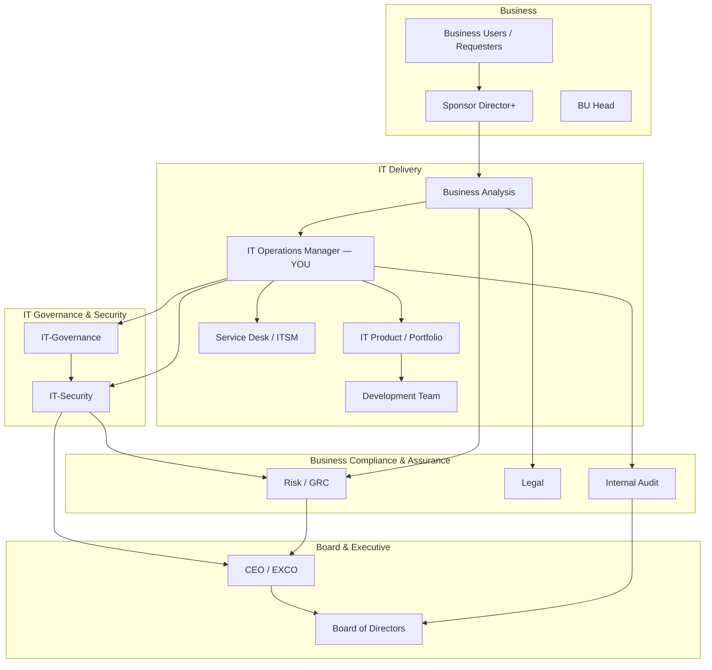
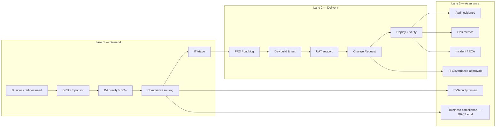
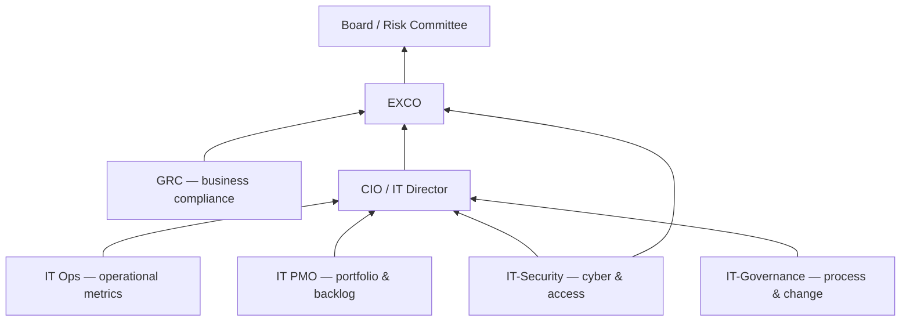
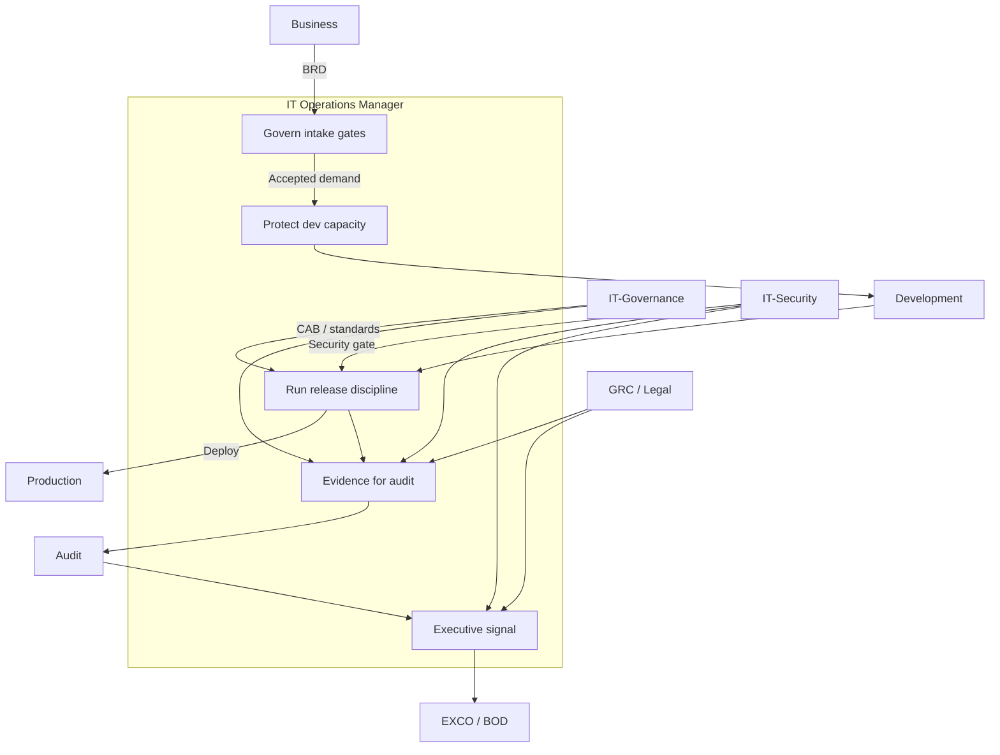

# IT Operations Manager — Stakeholder & Delivery Framework

How the **IT Operations Manager** orchestrates the **development team** and **stakeholders** (business users, **IT-Governance**, **IT-Security**, governance/compliance, audit, BOD) from demand intake through production operations.

**Related docs:** [IT Operations Runbook](14-it-operations-runbook.md) · [Governance RACI](10-governance-raci.md) · [Ops checklist](11-operations-manager-checklist.md) · [BRD quality gate](05-brd-quality-checklist.md) · [Rollout plan](09-rollout-plan-8-weeks.md) · [Training slides](../exports/Finance-IT-Delivery-Framework-Slides.pptx)

---

## 1. Your role in one sentence

> **You translate business demand into controlled delivery** — protecting the bank, the dev team, and business outcomes through clear gates, evidence, and stakeholder alignment.

You are **not** the product owner, **not** the auditor, and **not** the approver of business rules. You **are** accountable for **how work enters IT**, **how it is delivered**, and **how it is evidenced** for governance and audit.

---

## 2. Stakeholder map



| Stakeholder | Primary interest | What they need from you |
|-------------|------------------|-------------------------|
| **Business users** | Faster, correct solutions | Clear intake path; predictable SLAs; no IT guessing rules |
| **Business Sponsor** | Accountability; ROI; go-live confidence | Evidence of gates; UAT support; deployment schedule |
| **Development team** | Clear requirements; stable priorities; safe deploy | Accepted BRD/FRD; no scope via email; protected release windows |
| **BA** | Quality requirements; compliance routing | Enforced intake gate; escalation on informal requests |
| **IT Product** | Portfolio fit; capacity; prioritization | Triage-ready BRDs; honest backlog reporting |
| **IT-Governance** | IT policy adherence; change control; architecture standards; audit-ready process | CAB discipline; CMDB linkage; no shadow IT; evidence chain per release |
| **IT-Security** | Cyber risk; data protection; secure SDLC; access control | Early security routing; no control bypass; exception register |
| **Risk / GRC** | Business control impact; regulatory alignment | Timely compliance routing; BRD Section N flags; no shadow changes |
| **Legal** | Contract, fees, customer comms | Early involvement on Critical triggers |
| **Internal Audit** | Traceability; policy adherence | Complete evidence packs; no deploy without BRD/UAT |
| **BOD / EXCO** | Strategic risk; material incidents | Executive summaries — not ticket detail |

### IT-Governance vs IT-Security vs Risk/GRC

| Function | Scope | Examples | Typical owner |
|----------|-------|----------|---------------|
| **IT-Governance** | *How IT runs* — process, standards, architecture, change | BRD/FRD gate policy; CAB; CMDB; ITSM workflow; portfolio standards | IT Governance Manager / IT PMO |
| **IT-Security** | *How IT protects* — cyber, access, data, secure delivery | Security architecture review; IAM; DLP/MFA; vuln/patch; pen test; IR | CISO / IT-Security |
| **Risk / GRC** | *How the bank complies* — business & regulatory controls | Credit policy; collections; fees/contracts; SBV reporting; vendor risk | GRC Manager |

> **Rule for Ops:** Route **IT process & change** questions to **IT-Governance**; route **security & access** questions to **IT-Security**; route **business/regulatory control** questions to **Risk/GRC**.

---

## 3. Three-lane operating model

Separate **what business owns**, **what IT builds**, and **what assurance verifies**.



| Lane | Owner | IT Ops Manager role |
|------|-------|---------------------|
| **Demand** | Business + BA | **Enforce** intake gates; block wrong-bucket work |
| **Delivery** | IT Product + Dev | **Protect** team capacity; run release discipline |
| **Assurance** | IT-Gov + IT-Security + GRC + Audit + Ops | **Produce** evidence; route reviews; report exceptions |

---

## 4. End-to-end lifecycle — who is involved when

| Phase | Business | Sponsor | BA | IT Product | **IT Ops** | Dev | **IT-Gov** | **IT-Sec** | GRC / Legal | Audit | BOD |
|-------|----------|---------|-----|------------|------------|-----|----------|----------|-------------|-------|-----|
| 1. Idea / problem | R | A | C | I | I | — | I | I | I | — | — |
| 2. Draft BRD | R | C | C | I | I | — | I | I | I | — | — |
| 3. Sponsor sign-off | C | R/A | I | I | I | — | I | I | I | — | — |
| 4. BA quality gate | I | I | R/A | I | **A** enforce | — | C | C | C | — | — |
| 5. Compliance review | C | I | R | I | C route | — | I | C | R | I | — |
| 6. IT triage | I | C | C | R/A | **C** | I | C | C | C | — | — |
| 7. FRD / sprint plan | C | I | R | A | C | R | C | C | C | — | — |
| 8. Build & SIT | I | I | C | A | C | **R** | I | C | I | — | — |
| 9. UAT | **R** | A | C | C | C env | C fix | I | I | I | — | — |
| 10. Change / deploy | I | C | I | R | **R/A** | R | **A** CAB | C | C | I | — |
| 11. Hypercare | C | A | C | C | **R** | C | I | I | I | — | — |
| 12. Audit sample | C | I | C | I | **R** evidence | C | C | C | C | **R/A** | I |
| 13. Material incident | C | A | I | C | **R** RCA | C | C | **R** | C | C | **I** |

*R = Responsible, A = Accountable, C = Consulted, I = Informed*

---

## 5. Working with the development team

### 5.1 What dev needs from you

| Need | Your commitment |
|------|-----------------|
| **Stable requirements** | No sprint work without accepted BRD + approved FRD link |
| **Prioritized backlog** | Single source of truth via IT Product; no side queues |
| **Protected focus** | Redirect informal requests; Service Desk trained |
| **Safe releases** | CR process; rollback plan; no Friday prod deploys (unless emergency policy) |
| **Clear environments** | UAT ready before business testing; data masking rules |
| **Escalation shield** | You handle stakeholder pressure; dev gets decision in writing |

### 5.2 What you need from dev

| Expectation | Evidence |
|-------------|----------|
| Work only from **linked FRD / story** | Jira ticket ↔ BRD ID |
| **Definition of Done** includes traceability | AC mapped to tests |
| **Release notes** per deploy | CR attachment |
| **No prod config** outside Change | CMDB / pipeline only |
| Incident **RCA** within SLA | Post-mortem template |
| Honest **estimates & blockers** | Sprint review |

### 5.3 Dev collaboration cadence

| Forum | Frequency | Attendees | Purpose |
|-------|-----------|-----------|---------|
| **Delivery stand-up** | Daily | Dev lead, Ops, IT Product | Blockers, deploy today, env issues |
| **Sprint planning** | Bi-weekly | Dev, BA, IT Product, Ops | Capacity; FRD readiness check |
| **Sprint review / demo** | Bi-weekly | Dev, BA, Business, Ops | Show working software; UAT prep |
| **Release readiness** | Per release | Dev, Ops, IT Product, Sponsor delegate, **IT-Security** (if High/Critical) | Go/no-go checklist |
| **Retrospective** | Bi-weekly | Dev, Ops, BA | Process improvement |

### 5.4 Dev team rules of engagement (publish to team)

1. **No BRD → no story → no code** for business change.
2. **Scope change** = change request to BA/Sponsor — not a Slack message to dev.
3. **Production access** only via approved CR and break-glass policy — **IT-Security** owns access standards.
4. **Architecture / integration** changes require **IT-Governance** (ARB) sign-off before sprint commit.
5. **Hotfix** still needs retro-BRD within 2 business days if business logic touched.
6. Ops Manager is **first escalation** for stakeholder conflict — not individual developers.

---

## 6. Working with business users & sponsors

### 6.1 Engagement principles

| Principle | Practice |
|-----------|----------|
| **Business defines; IT delivers** | Coach users on BRD — don't write business rules for them |
| **One front door** | ServiceNow/Jira BRD catalog only |
| **Sponsor accountability** | Director+ sign-off before triage |
| **Predictable SLAs** | BA 2d review; triage 5d — communicate delays early |
| **UAT is business work** | Provide environment; business executes test cases |

### 6.2 Business touchpoints

| Touchpoint | When | Owner | Ops role |
|------------|------|-------|----------|
| BRD training / coaching | Onboarding + returns | BA | Support gate enforcement |
| BRD accepted notification | Post quality gate | BA | Inform triage timeline |
| UAT kickoff | Pre-release | BA + Business | Confirm env, schedule, data |
| Go-live comms | Pre-deploy | Sponsor | Confirm rollback owner named |
| Hypercare | T+1 to T+14 | Ops + Dev | War room if Critical release |

### 6.3 Messages for business (use consistently)

> *"IT cannot build what business has not defined and signed. Your BRD is the contract for what we deliver."*

> *"UAT pass is your sign-off that it meets acceptance criteria — not IT's judgment."*

> *"Import files and business rules are owned by business — IT executes after approval."*

---

## 7. Working with IT-Governance, IT-Security & business compliance

### 7.1 When to involve whom

| Trigger | Route to | SLA | Ops action |
|---------|----------|-----|------------|
| New BRD / demand intake; process gate | **IT-Governance** | 2 business days | Confirm catalog workflow; no informal intake |
| Architecture / integration impact | **IT-Governance** (ARB) | 5 business days | Flag before sprint commitment |
| Production Change Request | **IT-Governance** (CAB) | Per CAB calendar | Submit CR pack; no deploy without approval |
| CMDB / CI not linked to change | **IT-Governance** | — | Block CR until linked |
| Any Compliance Q = Yes (BRD Section N) | **Risk / GRC** | +3 business days | Auto-route; do not start build |
| Restricted data classification | **IT-Security** | Parallel | Flag in triage; architecture review |
| Remote / home access; MFA / DLP exception | **IT-Security** | 5 business days | Block deploy until cleared |
| New integration / third-party connectivity | **IT-Security** + Vendor Risk | Parallel | Security assessment |
| Secure SDLC / pen test required | **IT-Security** | Per release policy | Schedule before prod |
| Fees / contract change | **Legal** + Finance | Parallel | **Critical** path |
| Collections / legal process | **GRC** + Compliance | Parallel | Legal template check |
| P1 security incident | **IT-Security** | Immediate | Activate IR playbook |

### 7.2 IT-Governance — your operating contract

| IT-Governance owns | IT Ops delivers |
|--------------------|-----------------|
| BRD/FRD intake policy & quality gate standard | Enforce gate; zero deploy without BRD |
| Change management policy & CAB charter | Run CR discipline; evidence per change |
| Architecture standards & ARB decisions | Escalate integration/architecture early |
| CMDB accuracy & CI lifecycle | Link every prod change to CI |
| ITSM workflow design | Service Desk redirect script compliance |
| Portfolio demand governance (with IT PMO) | Honest triage backlog reporting |
| Audit evidence standard | Complete 13-artifact pack per release |

**Your contract with IT-Governance:**
- You **never** bypass CAB or CMDB linkage for convenience.
- You **escalate** systemic gate failures (e.g. repeated deploys without BRD).
- IT-Governance **sets policy**; you **operate** it — they do not manage dev day-to-day.
- Joint **monthly** review of gate metrics and exception register.

### 7.3 IT-Security — your operating contract

| IT-Security owns | IT Ops delivers |
|------------------|-----------------|
| Security architecture review | Route Restricted data & new integrations early |
| IAM / privileged access policy | CR-only prod access; break-glass logged |
| Data classification enforcement | BRD Section I completed; no guessing |
| Vulnerability & patch SLAs | Coordinate maintenance windows via CAB |
| Security exception register | No MFA/DLP bypass without recorded exception |
| Secure SDLC / pen test gates | Security sign-off before Critical prod release |
| Security incident response | Notify within tier SLA; preserve evidence |

**Your contract with IT-Security:**
- You **block deploy** when security review is open — no verbal waivers.
- You **never** accept business requests to disable controls without IT-Security path.
- IT-Security reviews **technical risk**; GRC reviews **business/regulatory control** — both may apply.
- Security exceptions are **time-bound** and tracked in the exception register.

### 7.4 Business compliance (Risk / GRC / Legal)

| Function | Owns | Ops action |
|----------|------|------------|
| **Risk / GRC** | Regulatory & business control impact | Auto-route Section N flags |
| **Legal** | Contracts, fees, customer communications | Critical-path on Q2/Q3 triggers |
| **Vendor Risk** | Third-party data & outsourcing | Parallel on Q4 triggers |

**Your contract with GRC (unchanged principle):**
- You **never** hide informal production changes.
- You provide **BRD + FRD + CR + UAT** as a single evidence chain per release.
- You **escalate** when business pressures to skip compliance review.
- GRC **does not** manage dev backlog — they approve control impact.

### 7.5 Governance & security forums

| Forum | Frequency | Chair | Members | Output |
|-------|-----------|-------|---------|--------|
| **Change Advisory Board (CAB)** | Weekly | IT-Governance / Ops | Ops, Dev, **IT-Governance**, **IT-Security**, GRC, IT Product | Approved CRs |
| **Architecture Review Board (ARB)** | Bi-weekly | IT-Governance | BA, Dev, **IT-Security**, Architecture | Architecture decisions |
| **IT-Governance / Ops sync** | Monthly | IT-Governance Manager | Ops, BA Lead, ITSM | Gate metrics, policy gaps |
| **IT-Security exception board** | Bi-weekly | CISO / IT-Security | Ops, **IT-Governance**, Architecture | Exception register |
| **Compliance review** | As triggered | GRC Manager | BA, Legal, Ops, **IT-Security** (if data) | Clear / conditions |
| **Portfolio steering** | Monthly | IT PMO Director | Sponsors, BU Heads, Ops, **IT-Governance** | Priorities, deferrals |

---

## 8. Working with Internal Audit

### 8.1 Audit-ready evidence pack (per release)

| # | Artifact | Location | Retention |
|---|----------|----------|-----------|
| 1 | BRD (all versions) | Confluence / ITSM | 7 years |
| 2 | BA scorecard | ITSM / Jira | 7 years |
| 3 | Sponsor approval | Attachment | 7 years |
| 4 | IT-Security sign-off (if flagged) | Workflow / email | 7 years |
| 5 | GRC / Legal compliance sign-off (if flagged) | Workflow / email | 7 years |
| 6 | FRD linked to BRD | Jira / SPM | Life + 7 years |
| 7 | Test results (SIT) | Test tool | Per policy |
| 8 | UAT sign-off | Signed record | 7 years |
| 9 | Change Request + CAB approval | ITSM | 7 years |
| 10 | Deployment log | CI/CD / runbook | 7 years |
| 11 | Post-deploy verification | Ops ticket | 7 years |
| 12 | IT-Security scan / pen test (if required) | Security tool | Per policy |
| 13 | Incident / RCA (if any) | ITSM | 7 years |

### 8.2 Audit engagement rules

| Audit asks for… | You provide… | You do **not** provide… |
|-----------------|--------------|-------------------------|
| Sample of changes | Indexed evidence pack | Ad-hoc screenshots |
| Policy compliance | Gate metrics + exceptions log | Verbal assurance |
| Access to prod changes | CR + pipeline audit trail | Developer personal logs |
| Interviews | Ops + IT Product | Frontline dev without prep |

### 8.3 Proactive audit relationship

| Activity | Frequency |
|----------|-----------|
| Share **quarterly** ops metrics (deploys without BRD, emergency changes) | Quarterly |
| Pre-audit **evidence index** refresh | Before audit cycle |
| **Exception register** review with Audit | Quarterly |
| Joint walkthrough of one end-to-end release | Annually |

---

## 9. Working with BOD & executive leadership

### 9.1 What BOD cares about (and what they don't)

| BOD / EXCO cares about | Not appropriate for BOD |
|------------------------|-------------------------|
| Material IT risk incidents | Individual SR status |
| Regulatory / audit findings | Sprint velocity detail |
| Major program go-live / miss | BRD rework reasons |
| Cyber / data breach | Environment config |
| Strategic portfolio health | Developer staffing day-to-day |

### 9.2 Reporting ladder



### 9.3 Executive dashboard (monthly — you contribute)

| Metric | Green | Amber | Red |
|--------|-------|-------|-----|
| Deployments without linked BRD | 0 | 1 | ≥ 2 |
| Emergency prod changes | ≤ 2 / month | 3–4 | ≥ 5 |
| Critical open audit findings (IT) | 0 | 1 | ≥ 2 |
| P1 incidents (IT-owned) | 0 | 1 | ≥ 2 |
| BRD → triage avg days | ≤ 5 | 6–10 | > 10 |
| UAT sign-off before prod | 100% | 95–99% | < 95% |
| Open IT-Security exceptions (prod) | 0 | 1–2 | ≥ 3 |
| CAB exceptions (undeployed CR policy) | 0 | 1 | ≥ 2 |

*(Security exception and CAB metrics contributed jointly with IT-Security and IT-Governance.)*

### 9.4 When to escalate to BOD / Risk Committee

- Material customer or financial impact from IT change failure
- Confirmed data breach or prolonged outage (> SLA) — **IT-Security** leads, Ops supports evidence
- Repeated audit **high** finding on same control
- Regulatory deadline at risk with no mitigation
- Systemic bypass of BRD / change control

**Format:** 1-page brief — incident, impact, root cause, remediation, target date. No technical jargon.

---

## 10. Decision rights matrix

| Decision | Business | IT Product | IT Ops | **IT-Gov** | **IT-Sec** | GRC / Legal | Audit | BOD |
|----------|----------|------------|--------|----------|----------|-------------|-------|-----|
| Business rules & scope | **A** | C | I | I | I | C | I | — |
| BRD accept (≥ 80%) | C | I | I | C | C | C | — | — |
| **BA quality gate** | I | I | **A** enforce | C | C | C | — | — |
| IT architecture standard | I | C | C | **A** | C | I | — | — |
| Security architecture / exception | I | C | C | C | **A** | C | I | I if material |
| Portfolio priority | C | **A** | C | C | I | I | — | — |
| **CAB / deploy to production** | C (UAT) | R | **R** | **A** | C | C | I | — |
| Skip GRC compliance review | — | — | **Cannot** | I | I | **A** | I | I |
| Skip IT-Security review | — | — | **Cannot** | C | **A** | I | I | I |
| Emergency change | C | C | **R** | C | C | I | I | I if material |
| Reject informal intake | — | C | **A** | C | I | — | — | — |
| Strategic program kill | A | R | C | C | C | C | — | **A** if material |

---

## 11. Governance forums & calendar

| Forum | Cadence | Chair | You attend as | Key output |
|-------|---------|-------|---------------|------------|
| Ops daily huddle | Daily | Ops Manager | **Chair** | Deploy plan, blockers |
| Service Desk ↔ Ops sync | Weekly | Ops Manager | **Chair** | Wrong-bucket trends |
| **CAB** | Weekly | **IT-Governance** / Ops | **R** | Approved CRs |
| **ARB** | Bi-weekly | **IT-Governance** | C | Architecture decisions |
| **IT-Governance / Ops sync** | Monthly | IT-Governance Manager | **R** | Gate metrics, policy gaps |
| **IT-Security exception board** | Bi-weekly | IT-Security / CISO | C | Exception register |
| Sprint ceremonies | Bi-weekly | Scrum Master | C | Working software |
| BA quality review | Weekly | BA Lead | C | Acceptance rate |
| Portfolio steering | Monthly | IT PMO | **R** presenter | Priorities |
| GRC / IT sync | Monthly | GRC Manager | C | Open compliance items |
| Audit liaison | Quarterly | Audit Manager | **R** | Evidence readiness |
| EXCO IT report | Monthly | CIO | C | Dashboard slice |
| BOD Risk Committee | Quarterly | CRO | I | Material items only |

---

## 12. Communication protocol

### 12.1 Channel by audience

| Audience | Primary channel | Escalation channel |
|----------|-----------------|-------------------|
| Dev team | Teams / Jira | Ops daily → Dev lead |
| Business users | ITSM notifications | Sponsor → BU Head |
| Sponsors | Email summary + ITSM | Portfolio steering |
| **IT-Governance** | CAB / ARB workflow; monthly sync | IT-Governance Manager |
| **IT-Security** | Security workflow; exception board | CISO / IT-Security lead |
| GRC / Legal | Compliance workflow tasks | GRC Manager |
| Audit | Formal request portal | CIO |
| BOD / EXCO | CIO pack | CEO office |

### 12.2 Status report template (weekly — internal)

```text
IT Operations — Week of [date]

RELEASES
- Completed: [CR IDs, systems, outcome]
- Planned: [CR IDs, risk level, UAT status]
- Blocked: [reason, owner, ETA]

DEMAND & GATES
- BRDs accepted: [count]
- BRDs returned: [count, top reasons]
- Wrong-bucket redirects: [count]
- Deploys without BRD: [must be 0]

RISKS & EXCEPTIONS
- Emergency changes: [count + retro-BRD status]
- Open GRC / Legal holds: [list]
- Open IT-Security reviews / exceptions: [list]
- CAB / IT-Governance holds: [list]
- P1/P2 incidents: [summary]

DECISIONS NEEDED
1.
2.

NEXT WEEK FOCUS
-
```

### 12.3 Incident communication tiers

| Severity | Notify within | Audience |
|----------|---------------|----------|
| P4 — minor | 1 business day | Dev, Ops |
| P3 — degraded | 4 hours | + IT Product, Sponsor |
| P2 — major | 1 hour | + **IT-Security**, GRC, CIO |
| P1 — critical | 30 min | + **IT-Security** IR, EXCO; BOD if material impact |

---

## 13. Conflict resolution

| Conflict | Resolution path |
|----------|-----------------|
| Business wants skip BRD | Ops cites **IT-Governance** policy → Sponsor → BU Head → IT Director |
| Dev vs Business on scope | BA clarifies FRD → IT Product decides → Sponsor if dispute |
| GRC slow; business pressures deploy | Ops documents hold → GRC Manager → no deploy |
| **IT-Security** review open; deploy pressured | Ops blocks CR → IT-Security lead → no deploy |
| **IT-Governance** / CAB rejects change | Ops documents reason → IT Product → Sponsor |
| Audit finding vs delivery pressure | Remediation plan → CIO → no shortcut |
| Sponsor bypasses UAT | Ops blocks CR → Sponsor accountable |
| Dev asked to "just change prod" | Ops redirects to CR; log attempt → **IT-Governance** |

**Your default stance:** *Document the decision request in writing. No verbal-only production changes.*

---

## 14. IT Ops Manager — weekly rhythm

| Day | Focus |
|-----|-------|
| **Mon** | Week plan: releases, CAB prep, backlog risks |
| **Tue** | Business alignment: triage status, UAT schedule |
| **Wed** | Dev sync: sprint health, env, tech debt flags |
| **Thu** | Assurance: **IT-Governance** + **IT-Security** holds, GRC items, audit asks, exception log |
| **Fri** | Metrics + report; no prod deploy unless emergency |

See also: [Operations Manager Checklist](11-operations-manager-checklist.md) for daily/weekly tasks.

---

## 15. Framework summary



| Pillar | Action |
|--------|--------|
| **Govern** | Enforce BRD gate with **IT-Governance**; route **IT-Security**; reject wrong-bucket work |
| **Deliver** | Align dev, BA, Product; stable priorities; safe releases via CAB |
| **Assure** | Evidence packs; metrics; honest reporting to Audit, **IT-Security**, GRC & BOD |
| **Align** | Clear forums (CAB, ARB, exception board); escalation paths; one front door for demand |

---

## 16. Implementation checklist

| # | Action | Owner | ☐ |
|---|--------|-------|---|
| 1 | Publish this framework in Confluence `Process & Governance` | Ops Manager | |
| 2 | Train Service Desk on business vs IT bucket | Ops + ITSM | |
| 3 | Train dev leads on "no BRD no code" | Ops + Dev lead | |
| 4 | Agree CAB charter with **IT-Governance** + **IT-Security** + GRC | Ops + IT Director | |
| 5 | Define evidence pack template in ITSM (incl. IT-Sec & CAB fields) | Ops + BA + IT-Governance | |
| 6 | Set up monthly exec dashboard with IT-Gov / IT-Sec metrics | Ops + PMO | |
| 7 | Schedule quarterly Audit liaison | Ops + Audit | |
| 8 | Brief Sponsors on UAT accountability | BA + Ops | |
| 9 | Establish monthly **IT-Governance / Ops** sync | Ops + IT-Governance | |
| 10 | Align **IT-Security** exception process with CAB | Ops + IT-Security | |

---

*IT Operations Stakeholder Framework v1.1 | Finance BRD Training Package*
