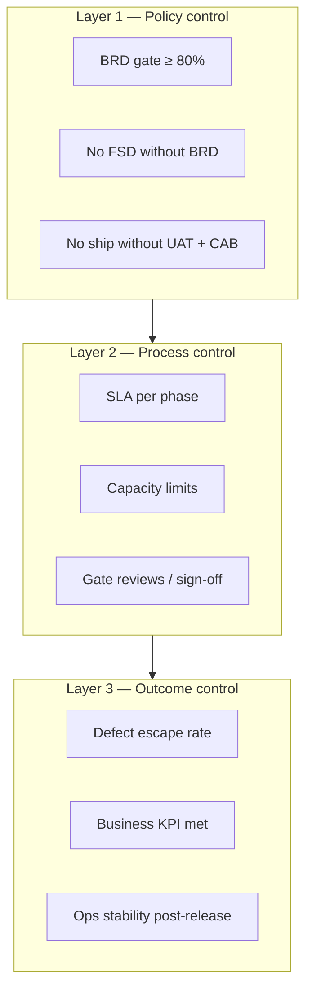
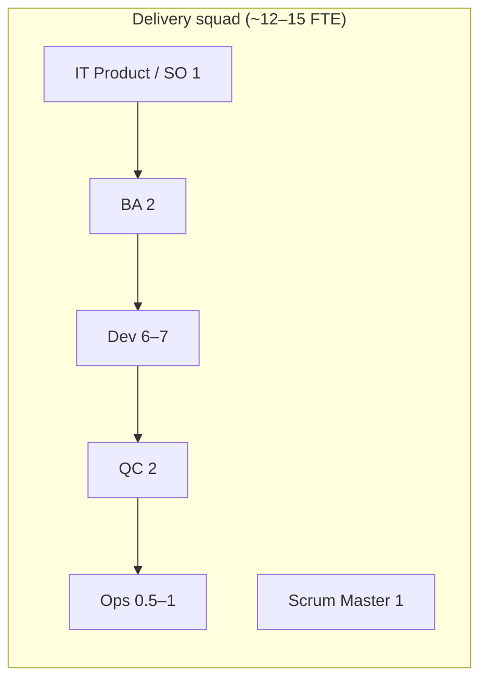

# Service Owner & Manager Guide — Delivery Control, Evaluation & Resourcing

How **Service Owners (SO)** and **delivery managers** control the pipeline, evaluate quality, size **BA / Dev / QC / Ops** teams, and validate that requirements are correct and operations remain excellent.

**Related docs:** [Stakeholder framework](12-it-operations-stakeholder-framework.md) · [Ops checklist](11-operations-manager-checklist.md) · [Governance RACI](10-governance-raci.md) · [BRD quality gate](05-brd-quality-checklist.md)

---

## 1. Your accountability as SO / Manager

| Role | You are accountable for | You are not accountable for |
|------|-------------------------|----------------------------|
| **Service Owner (SO)** | End-to-end service outcomes, backlog priority, business alignment, UAT accountability with Sponsor | Writing code; approving business rules alone |
| **Delivery Manager** | Pipeline health, capacity, gates enforced, release quality, team productivity | Bypassing GRC or IT-Security for speed |
| **IT Ops Manager** | Ship discipline, CAB, hypercare, evidence, ops excellence | Defining business requirements |

> **One line:** *You control the pipeline; you do not shortcut the gates.*

---

## 2. Control model — three layers



| Layer | Question you ask | Frequency |
|-------|------------------|-----------|
| **Policy** | Are hard gates enforced? | Weekly sample audit |
| **Process** | Is each phase within SLA and capacity? | Weekly delivery review |
| **Outcome** | Did we deliver the right thing, safely? | Per release + monthly |

---

## 3. Pipeline phases — what to control & evaluate

### 3.1 Phase control matrix

| Phase | Control point (SO/Manager) | Primary metric | Target | Owner |
|-------|---------------------------|----------------|--------|-------|
| **Receive req** | Wrong-bucket rate | % redirected to BRD vs Service Desk | Trend down | Ops + ITSM |
| **BRD gate** | Quality before build | First-pass acceptance ≥ 80% | ≥ 60% → 75% | BA Lead |
| **Compliance** | No build before review | % flagged BRDs reviewed before FSD | 100% | BA + GRC |
| **IT triage** | Honest prioritization | Triage decision ≤ 5 days | < 5 days | IT Product |
| **FSD** | Traceability | % stories linked to BRD AC | 100% | BA |
| **Sprint / Dev** | No scope creep | Unplanned story % per sprint | < 10% | Dev lead |
| **SIT / QC** | Defect detection | Sev-1/2 found in SIT (not prod) | > 95% | QA Lead |
| **UAT** | Business validation | UAT sign-off before prod | 100% | Sponsor |
| **Ship** | Controlled change | Deploys without CAB / BRD | **0** | Ops |
| **Ops support** | Stability | P1/P2 in hypercare window | 0–1 per release | Ops |

### 3.2 Evaluation scorecard (per release)

Score each release **1–5** (1 = fail, 5 = excellent). **Pass = avg ≥ 4.0 and no 1 on any gate item.**

| # | Criterion | 1 | 3 | 5 | Weight |
|---|-----------|---|---|---|--------|
| 1 | BRD complete & Sponsor signed before FSD | Missing | Partial | Full trace | 20% |
| 2 | FSD matches BRD scope (no drift) | Major drift | Minor gaps | Aligned | 20% |
| 3 | SIT exit criteria met | Failed | With exceptions | Clean | 15% |
| 4 | UAT by business (not IT proxy) | Skipped | Partial | Full sign-off | 20% |
| 5 | CAB + evidence pack complete | Missing | Partial | Complete | 15% |
| 6 | Post-release stability (T+14) | P1 incident | Minor issues | Stable | 10% |

**SO action:** Release scoring < 4.0 → mandatory retrospective; repeat → escalate to IT Director.

---

## 4. Validating *correct requirements* (business) vs *excellent ops*

### 4.1 Business correctness checklist (before FSD approved)

| Validate | How | Who signs |
|----------|-----|-----------|
| Problem is business need, not IT solution | BA score ≥ 80%; no tech keywords in to-be | BA |
| Business rules complete | Section H; no "TBD" on approval/cut-off | Sponsor |
| Acceptance criteria testable | Min 5 Given/When/Then; map to UAT | BA + Sponsor |
| Scope bounded | In-scope AND out-of-scope written | Sponsor |
| Compliance honest | Section N; routing complete | GRC if flagged |
| Sponsor accountable | Director+ sign-off on file | Sponsor |

**SO validates:** "If we build exactly this FSD, will the business outcome in the BRD be achieved?" — **Yes in writing** before sprint commitment.

### 4.2 Operations excellence checklist (before & after ship)

| Validate | How | Who signs |
|----------|-----|-----------|
| Rollback tested | CR attachment | Ops |
| Monitoring & alerts | Runbook + dashboard | Ops + Dev |
| Service Desk ready | KB article published | Ops |
| Hypercare roster | Named people T+1–14 | Ops Manager |
| CMDB / CI updated | Linked to CR | IT-Governance |
| No emergency bypass | Or retro-BRD within 2 days | Ops |

**Manager validates:** "Can we operate this in production without heroics?" — **Yes** before CAB approval.

---

## 5. Resource model — BA, Dev, QC, Ops

### 5.1 Reference squad (Agile delivery unit)

For **one product stream** (e.g. FE ONLINE, POS/LOS, or Collections) at steady state:



| Role | FTE (steady) | Ratio to Dev | Primary duty in pipeline |
|------|--------------|--------------|--------------------------|
| **IT Product / SO** | 1 | 1 : 6–7 | Prioritize; accept sprint; align Sponsor |
| **BA** | 2 | 1 : 3–3.5 | BRD review, FSD, story refinement, UAT support |
| **Dev** | 6–7 | baseline | Build, unit test, SIT fixes |
| **QC (QA)** | 2 | 1 : 3–3.5 | SIT, regression, test automation |
| **Ops** | 0.5–1 | 1 : 7–14 | Release, CAB, env, hypercare |
| **Scrum Master** | 1 | 1 : 6–7 | Ceremonies, blockers (may be Dev lead dual hat) |

> **Rule of thumb:** In regulated finance, **BA + QC together ≈ 50–60% of Dev FTE**. **Ops is shared** across 2–3 squads (see §5.4).

### 5.2 Capacity formulas

Use these to check if you are under- or over-staffed.

#### BA capacity

```
BRD reviews per BA per month  = 6–8 (quality review only)
FSD epics per BA per month    = 2–3 (after BRD accepted)
Story refinement hours/sprint = 20–30% of BA time per squad
```

**Warning signs (need more BA):**
- BRD queue > 10 business days
- First-pass acceptance < 50%
- Dev blocked waiting for clarification > 20% of sprint days

#### Dev capacity

```
Effective dev capacity/sprint = (Dev FTE × 10 days) × 0.7   [30% meetings, support, leave]
Story points/sprint (guideline) = Dev FTE × 8–12 SP          [calibrate to your history]
```

**Warning signs (need more Dev or less WIP):**
- Carry-over > 25% every sprint for 3 sprints
- Unplanned work > 15% of capacity

#### QC capacity

```
QC should test ≥ 1.2× dev output (time) for regulated releases
Test cases per epic (guideline) = 1.5–2× BRD acceptance criteria count
Regression suite run before every prod release (non-negotiable)
```

**Warning signs (need more QC):**
- Sev-1/2 defects found in UAT or prod that SIT should have caught
- UAT blocked by environment/test data issues repeatedly
- QC bottleneck: stories "done" but waiting test > 3 days

#### Ops capacity

```
Ops FTE per squad (dedicated)     = 0.5 FTE if shared pool supports releases
Releases per Ops FTE per month    = 4–6 standard + 1–2 emergency max
CAB prep time per release         = 2–4 hours
Hypercare per major release       = 0.25–0.5 FTE for 2 weeks
```

**Shared Ops pool (typical for FE Credit scale):**

| Portfolio size | Squads | Ops FTE (pool) | IT-Governance (shared) |
|----------------|--------|----------------|-------------------------|
| Small (1 squad) | 1 | 1–1.5 | 0.5 |
| Medium (2–3 squads) | 2–3 | 2–3 | 1 |
| Large (4+ squads) | 4+ | 4–5 + 1 on-call | 1–2 |

### 5.3 Demand-driven staffing (BRD intake volume)

Adjust BA and triage capacity from **incoming BRD rate**:

| BRDs / month (portfolio) | BA (review + FSD) | IT Product (triage) | Dev squads |
|--------------------------|-------------------|---------------------|------------|
| 5–10 | 1–2 | 0.5 | 1 |
| 11–20 | 2–3 | 1 | 1–2 |
| 21–35 | 3–4 | 1 | 2–3 |
| 36+ | 4–6 | 1–2 | 3+ |

**Formula:**

```
BA FTE needed ≈ (BRDs per month ÷ 6) + (active epics ÷ 2.5)
```

Example: 24 BRDs/month + 8 active epics → (24÷6) + (8÷2.5) ≈ **4 + 3.2 → 4–5 BA** (with tooling and senior/junior mix).

### 5.4 Recommended ratios summary (FE Credit consumer finance)

| Ratio | Target range | If outside range |
|-------|--------------|------------------|
| **BA : Dev** | 1 : 3 to 1 : 4 | < 1:5 → quality risk; > 1:2 → over-spec |
| **QC : Dev** | 1 : 3 to 1 : 4 | < 1:5 → defects escape |
| **Ops : Dev** | 1 : 7 to 1 : 14 (shared) | Too low → release risk |
| **BRD rework cycles** | < 2 | > 2 → add BA coaching or training |
| **WIP epics per squad** | 2–3 max | > 4 → stop starting, start finishing |

---

## 6. Control cadence — your calendar

| Forum | Cadence | SO/Manager focus | Key outputs |
|-------|---------|------------------|-------------|
| **Demand review** | Weekly | BRD queue, triage backlog, wrong-bucket | Prioritized intake list |
| **Sprint review** | Bi-weekly | Demo vs BRD outcome; scope drift | Accepted / rejected increment |
| **Quality gate audit** | Weekly (sample 2 BRDs) | Score ≥ 80%? Sponsor? | Coaching actions |
| **Release readiness** | Per release | Scorecard §3.2 | Go / no-go |
| **CAB** | Weekly | CR quality, evidence | Approved changes |
| **Ops review** | Weekly | Incidents, hypercare, deploys without BRD | Exception log |
| **Monthly portfolio** | Monthly | Capacity vs demand, KPIs | Hiring / redeploy decision |
| **Quarterly framework review** | Quarterly | Gate effectiveness, ratios | Policy updates |

---

## 7. KPI dashboard — SO / Manager

### 7.1 Pipeline health (weekly)

| KPI | Green | Amber | Red | Action if red |
|-----|-------|-------|-----|---------------|
| BRD first-pass ≥ 80% | ≥ 60% | 45–59% | < 45% | BRD training blitz |
| BRD → triage days | ≤ 5 | 6–10 | > 10 | Add IT Product time |
| FSD without accepted BRD | 0 | 1 | ≥ 2 | Stop squads; audit |
| Sprint unplanned % | < 10% | 10–20% | > 20% | Fix intake / PO |
| SIT escape to UAT (Sev-1/2) | 0 | 1 | ≥ 2 | Add QC; review AC |
| UAT before prod | 100% | 95–99% | < 95% | Block CAB |
| Deploy without BRD | 0 | 1 | ≥ 2 | Escalate to IT Director |
| Hypercare P1 | 0 | 1 | ≥ 2 | Release retrospective |

### 7.2 Quality & excellence (monthly)

| KPI | Target |
|-----|--------|
| Release scorecard avg (§3.2) | ≥ 4.0 |
| Business KPI met (from BRD Section C) | Track per epic at T+30 |
| Customer-impacting defects from releases | Trend down QoQ |
| Audit findings on delivery control | 0 high open |
| Team satisfaction (delivery friction survey) | ≥ 4/5 |

---

## 8. Decision tree — when to add resources

```text
Defects escape to production?
├─ YES → Root cause
│   ├─ Wrong/missing requirements → Add BA or tighten BRD gate
│   ├─ Missed in test → Add QC or extend SIT
│   ├─ Bad deploy/config → Add Ops or CAB discipline
│   └─ Code quality → Dev practices, not more heads first
│
BRD queue > 10 days?
├─ YES → Add BA OR reduce business WIP OR improve first-pass (training)
│
Sprint carry-over chronic?
├─ YES → Reduce WIP OR add Dev OR split squad
│
Ops firefighting every week?
├─ YES → Add Ops FTE OR reduce release frequency OR improve hypercare handover
```

**Do not** add Dev capacity until BRD/FSD gate is stable — you will only build the wrong thing faster.

---

## 9. SO / Manager weekly checklist

| # | Check | ☐ |
|---|-------|---|
| 1 | Sampled 2 BRDs — gate enforced? | |
| 2 | No squad started sprint without FSD ↔ BRD link | |
| 3 | QC exit criteria defined before UAT starts | |
| 4 | UAT owners named (business, not IT) | |
| 5 | This week's releases have evidence pack template started | |
| 6 | Capacity: BRD queue vs BA FTE still in SLA | |
| 7 | Wrong-bucket SR count reviewed with Service Desk | |
| 8 | Exception register (emergency changes) reviewed | |
| 9 | One conversation with Sponsor on priority trade-offs | |
| 10 | Team not above WIP limit (2–3 epics/squad) | |

---

## 10. Example — sizing one FE Credit stream

**Scope:** FE ONLINE 2.0 enhancements + POS visibility  
**Demand:** ~18 BRDs/month, 2 active squads worth of epics

| Role | FTE | Rationale |
|------|-----|-----------|
| IT Product / SO | 1 | Single backlog owner |
| BA | 3 | 18÷6 = 3 reviewers; FSD load covered |
| Dev | 12 | 2 squads × 6 |
| QC | 4 | 1:3 ratio to Dev |
| Scrum Master | 2 | 1 per squad (or 1 SM + 1 tech lead) |
| Ops (shared pool) | 2 | ~6 releases/month across streams |
| IT-Governance (shared) | 1 | CAB + standards |

**Total delivery ~24 FTE** excluding GRC, IT-Security, Service Desk (on-demand).

---

## 11. Framework maturity levels

Use to evaluate how mature your control is:

| Level | Characteristics | SO/Manager focus |
|-------|-----------------|------------------|
| **1 — Ad hoc** | Email intake; no BRD gate; hero releases | Implement gates; stop informal work |
| **2 — Defined** | BRD form; CAB; basic metrics | Train business; enforce FSD link |
| **3 — Managed** | SLAs; scorecard; capacity model | Tune ratios; monthly portfolio |
| **4 — Optimized** | Predictable lead time; low escape rate | Continuous improvement; automate evidence |

**Target for FE Credit:** Level **3** by end of BRD rollout (Week 8+), Level **4** within 2 quarters.

---

## 12. Quick reference card

| Question | Answer |
|----------|--------|
| How do I control the pipeline? | Enforce gates; weekly sample audit; release scorecard |
| How do I evaluate quality? | §3.2 scorecard + KPI dashboard §7 |
| How many BA? | ~1 BA per 6–8 BRD reviews/month + 2–3 FSD epics |
| How many Dev? | Baseline squad 6–7 per stream; calibrate SP |
| How many QC? | 1 QC per 3–4 Dev |
| How many Ops? | Shared pool: 1 Ops per 4–6 releases/month |
| Business correct? | BRD ≥ 80%, Sponsor sign-off, UAT from AC |
| Ops excellent? | CAB, rollback, monitoring, hypercare, 0 deploy w/o BRD |

---

*Service Owner Delivery Control Guide v1.0 | FE Credit BRD Training Package*
