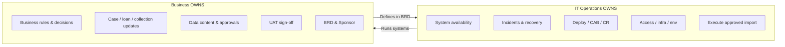
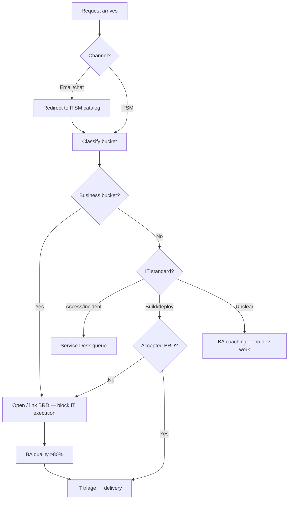
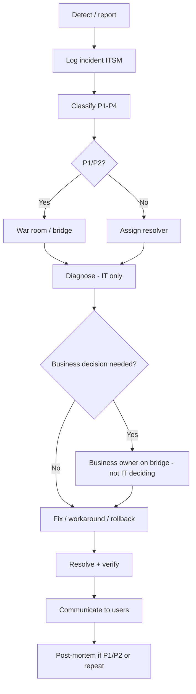

# IT Operations Runbook — Service Requests, Rituals, Incidents & Post-Mortems

Operational playbook for **IT Operations** and **Service Desk** to handle business requests, daily/monthly rituals (BOD/EOD/EOM/BOM), incidents, and post-mortems — while keeping **IT in the systems bucket**, not business activity.

**Related docs:** [Ops checklist](11-operations-manager-checklist.md) · [Stakeholder framework](12-it-operations-stakeholder-framework.md) · [Governance RACI](10-governance-raci.md) · [ServiceNow mapping](07-servicenow-jira-intake-mapping.md) · [Training slides](../exports/FE-Credit-IT-Operations-Guide-Slides.pptx)

---

## 1. Scope boundary — what IT Ops owns



| IT Ops handles | IT Ops does **not** handle |
|----------------|----------------------------|
| System down, slow, error (P1–P4) | "Update this customer's case status" (business workflow) |
| Password reset, access provisioning | "Change approval rule from 5pm to 6pm" (needs BRD) |
| Deploy after UAT + CAB | "Import this file" without business approval trail |
| Execute import **after** maker-checker | Business judgment on loan/collection decisions |
| Environment, monitoring, rollback | UAT pass/fail on behalf of business |
| Route SR to correct bucket | Write business requirements for business |

**Script for Service Desk:**  
> *"IT fixes systems and access. Business owns case updates, rules, and data decisions. I'll route you to the right channel."*

---

## 2. Service request handling — end-to-end process

### 2.1 Process flow



### 2.2 Bucket allocation matrix

| If the request is about… | Bucket | Catalog / queue | IT action |
|--------------------------|--------|-----------------|-----------|
| Password, VPN, account lock | **IT** | Service Desk | Resolve per SLA |
| System error / outage | **IT** | Incident | Major incident process §5 |
| "System won't let me save" | **IT** | Incident or SR | Diagnose; if business rule → redirect |
| "Change who approves loans" | **Business** | BRD intake | Redirect; no config change |
| "Update 500 case statuses" | **Business** | BRD + import approval | Block until maker-checker |
| "Add field to screen" | **Business** | BRD intake | After BRD → FRD → build |
| "Run report with new column" | **Business** | BRD intake | Business defines; IT builds |
| "Deploy release Saturday" | **IT** | Change Request | CAB + UAT link |
| "Import partner file today" | **Business + IT** | BRD + import SR | IT executes only after business sign-off |
| "Why was loan rejected?" | **Business** | Business ops / Credit | **Not IT** — business explains rules |
| "Fix bug after go-live" | **IT** | Incident → defect | Link to release / BRD |

### 2.3 Service Desk triage runbook (every SR)

| Step | Action | Time | Record in ITSM |
|------|--------|------|----------------|
| 1 | Acknowledge receipt | ≤ 15 min (P3) | Ticket created |
| 2 | **Classify bucket** (matrix §2.2) | ≤ 30 min | Field: `bucket` = IT / Business / Incident |
| 3 | If **Business bucket** → send redirect template | ≤ 1 hr | State: `Redirected — BRD required` |
| 4 | If **IT bucket** → assign group + priority | ≤ 1 hr | Assignment + SLA |
| 5 | If **duplicate / wrong channel** → link parent | — | Parent ticket ID |
| 6 | Log **wrong-bucket count** for weekly report | EOD | Ops dashboard |

**Redirect template (business bucket):**

```text
Your request changes business rules, data, or process — business must define this in a BRD before IT can execute.

Next steps:
1. Complete BRD: [catalog link] or BRD Intake App
2. Obtain Sponsor (Director+) sign-off
3. Submit via official channel — not email

IT does not update cases, approval rules, or bulk data without this trail.

Reference: FECBRD / Operations Runbook §2
```

### 2.4 Allocation decision tree (quick)

```text
START
│
├─ Is it system broken / access / performance? ──YES──► IT Incident or Service Desk
│
├─ Is it "update case / account / status / rule / import"? ──YES──► BUSINESS bucket → BRD
│
├─ Is it build / enhance / integrate? ──YES──► Accepted BRD? ──NO──► BRD first
│                                              └─ YES ──► IT triage
│
└─ Unsure ──► BA 30-min triage call — DO NOT assign to Dev
```

---

## 3. Operational rituals — BOD, EOD, EOM, BOM

### 3.1 Calendar overview

| Ritual / shift | When | Duration | Owner | Purpose |
|----------------|------|----------|-------|---------|
| **Night shift** | Daily **20:00 – 24:00** (Mon–Fri) | 4 hr | On-call / night Ops | Monitor · batch · on-call · handover to BOD |
| **BOD** — Beginning of Day | Daily **04:00 – 08:00** | 4 hr window | Ops Manager | Ready state before business starts |
| **Business app allocation** | Daily **07:30** | — | Business users | Allocate workload in apps — Ops must confirm systems green |
| **Day shift** | Weekday **08:30 – 17:30** | 9 hr | Service Desk + Ops | IT catalog SR · incidents · delivery control |
| **EOD** — End of Day | Daily 17:30 | 20 min | Ops / Service Desk lead | Handover to night (20:00) |
| **Weekend day shift** | Sat–Sun **only if triggered** | **Max 4 hr** | Ops Manager (approved) | Late data · allocation incident · critical IT catalog SR |
| **Weekend standard** | Sat–Sun | BOD + EOD | On-call | No full day shift unless trigger below |
| **BOM** — Beginning of Month | 1st business day 09:00 | 60 min | Ops + IT PMO | Capacity, backlog, metrics |
| **EOM** — End of Month | Last business day 15:00 | 60 min | Ops + GRC + Finance IT | Close, audit, regulatory cut-off |

**Weekday timeline:**

```text
20:00–24:00 ─ Night shift (monitor, batch, on-call)
04:00 ─── BOD window opens (health, batches, releases)
07:30 ─── Business users allocate apps (systems must be green)
08:00 ─── BOD complete · publish BOD log
08:30 ─── Day shift starts (Service Desk lead)
17:30 ─── EOD handover to night (20:00)
```

**Weekend coverage (limited):**

```text
Standard:  BOD (04:00–08:00) + on-call monitor + EOD only
Extended:  Day shift MAX 4 hours — Ops Manager approval required
Triggers:  • Batch/data feed late — business cannot allocate
           • P1/P2 incident affecting allocation or catalog access
           • Critical IT catalog SR (access/system) — NOT feature delivery
Out of scope weekends: case updates, rules, features, BRD — business self-service
```

---

### 3.1a Ops roster — resource allocation

| Work type | Handler | IT action |
|-----------|---------|-----------|
| Access, VPN, password | IT Service Desk (catalog) | Resolve per SLA |
| System down / slow / error | IT Incident | Restore service |
| Deploy / CR / CAB | IT Ops | Governance path |
| **Case update / allocation dispute** | **Business ops** | Redirect — logs only |
| Rule change / new feature | Business (BRD) | Redirect — no Dev assign |
| Import execution | IT after business approval | Execute maker-checker file |

**Roster:** Publish weekly — name | shift (night/day/weekend) | backup | escalation path.

**Case handling rule:** IT never owns case outcome. Delegate to business unit same day; document `wrong_bucket_redirect` in ITSM.

---

### 3.1b IT catalog — support only (not feature delivery)

| In IT catalog (resolve) | Not in catalog (delegate to business) |
|-------------------------|--------------------------------------|
| Password / VPN / access | Update case / status / allocation |
| Account lock | Change approval rules |
| System error / performance | New screen / report / feature |
| Approved import run | Explain loan rejection / fix outcome |
| Integration down | UAT sign-off proxy |

Feature delivery and business changes → **BRD intake** — never Service Desk queue.

---

### 3.2 BOD runbook (daily — 04:00 to 08:00)

**Attendees:** Ops Manager, night shift handover (prior day 20:00–24:00), on-call Dev, release coordinator  
**Output:** BOD log in ITSM / Confluence (dated) — **published by 08:00**

| # | Time | Activity | Check | Owner |
|---|------|----------|-------|-------|
| 1 | 04:00 | Open BOD window; receive **night shift** handover (20:00–24:00) | ☐ | Ops Manager |
| 2 | 04:00+ | Review **overnight** incidents & open P1/P2 | ☐ None open or owned | On-call |
| 3 | | Confirm **production health** + overnight batch jobs | ☐ | Ops |
| 4 | | **Releases today** — CR approved? UAT linked? | ☐ List CR IDs | Release coord |
| 5 | | **CAB yesterday** outcomes — any failed deploy? | ☐ | Ops |
| 6 | | **Hypercare** releases (T+1 to T+14) — check with Sponsor | ☐ | Ops |
| 7 | | Service Desk: **wrong-bucket** count yesterday | ☐ | SD lead |
| 8 | | **BRD queue** — any > 5 days triage? Escalate | ☐ | Ops |
| 9 | **07:30** | Confirm **apps green** for business user allocation | ☐ | Ops Manager |
| 10 | **Weekend?** | Approve extended day roster (max 4 hr) only if data late / allocation incident | ☐ | Ops Manager |
| 11 | | **Freeze windows** (EOM/regulatory) — announce if active | ☐ | Ops |
| 12 | **08:00** | Publish **BOD log**; assign day-shift escalation path | ☐ | Ops Manager |
| 13 | **08:30** | **Day shift** (08:30–17:30) assumes Service Desk lead | ☐ | SD lead |

**BOD log template:**

```text
BOD — [date] (window 04:00–08:00)
Weekend mode: [standard / extended 4h] | Trigger: [data late / incident / none]
Business-ready by 07:30: [yes/no] | Day shift: 08:30–17:30 | Night: 20:00–24:00
On-call: [name] | Releases today: [CR-xxx / none]
Open P1/P2: [count] | Hypercare: [release name / none]
Wrong-bucket SRs (prior day): [n]
Blockers: [list]
```

---

### 3.3 EOD runbook (daily — 17:30, end of day shift)

**Attendees:** Service Desk lead (day shift 08:30–17:30), Ops duty, release coordinator (if deploy day)

| # | Activity | Check | Owner |
|---|----------|-------|-------|
| 1 | All **P1/P2** updated in ITSM (not stale) | ☐ | SD / Ops |
| 2 | **Open SRs** — none unassigned > SLA | ☐ | SD lead |
| 3 | **Business-bucket redirects** logged with reason | ☐ | SD lead |
| 4 | **Deployments today** — post-deploy verify complete? | ☐ | Ops |
| 5 | **Emergency changes** — retro-BRD task opened if needed | ☐ | Ops |
| 6 | Handover note for **night shift (20:00–24:00)** / weekend on-call | ☐ | Ops |
| 7 | **No informal prod changes** via chat — audit sample | ☐ | Ops |
| 8 | Update **Ops dashboard** metrics (daily slice) | ☐ | Ops |

**EOD handover template:**

```text
EOD — [date]
Carry to tomorrow: [ticket IDs]
Waiting on business: [BRD / UAT / import approval IDs]
On-call notes: [any watch items]
```

---

### 3.4 BOM runbook (monthly — 1st business day)

**Attendees:** Ops Manager, IT PMO, BA Lead, Service Desk lead, IT Product

| # | Activity | Output |
|---|----------|--------|
| 1 | Review **last month KPIs** (§7) | Dashboard |
| 2 | **BRD volume** vs BA capacity — hiring/adjust? | Capacity note |
| 3 | **Release calendar** for month — blackout dates (EOM, SBV) | Published calendar |
| 4 | **Incident trend** — top 3 recurring | Action items |
| 5 | **Wrong-bucket rate** — training needed for which BU? | Training plan |
| 6 | **Open audit / GRC** items affecting ops | Escalation list |
| 7 | **DR / patch** windows scheduled | CR placeholders |
| 8 | Confirm **CAB roster** and Ops coverage | Roster updated |

---

### 3.5 EOM runbook (monthly — last business day)

**Attendees:** Ops Manager, GRC delegate, Finance IT liaison, Service Desk lead

| # | Activity | Check | Notes |
|---|----------|-------|-------|
| 1 | **Change freeze** for critical systems (if policy) — communicate | ☐ | Lending, collections, GL |
| 2 | No **non-emergency prod deploy** last 2 business days (unless approved) | ☐ | Ops enforces |
| 3 | **Emergency changes** this month — all retro-BRD closed? | ☐ | Exception register |
| 4 | **Evidence pack** sample — 2 random releases complete? | ☐ | Audit readiness |
| 5 | **Deploys without BRD** = 0 for month | ☐ | **Hard KPI** |
| 6 | **UAT before prod** = 100% for month | ☐ | |
| 7 | **Incident summary** to leadership (P1 count, MTTR) | ☐ | 1-page |
| 8 | **Lessons learned** from month — top 3 to backlog | ☐ | Link §6 |
| 9 | **Service Desk** — EOM wrong-bucket report to BU Heads | ☐ | |
| 10 | Archive **BOD/EOD logs** for month | ☐ | Confluence / ITSM |

---

## 4. Incident runbook — business user ↔ IT

### 4.1 Incident vs service request vs business work

| Type | Example | Handler | SLA |
|------|---------|---------|-----|
| **Incident** | FE ONLINE down; POS cannot submit | IT Ops + Dev | P1–P4 |
| **Service request** | Password reset; new user access | Service Desk | Per catalog |
| **Business work** | "Fix wrong disbursement for customer X" | **Business ops** + Credit | Business SLA |
| **Defect** (after release) | Bug in new feature | IT — link to release | SIT/hotfix |

**Critical:** Customer outcome disputes (loan rejected, wrong amount) → **Business/Credit** leads; IT provides logs only.

### 4.2 Incident classification

| Priority | Definition | Examples | Notify |
|----------|------------|----------|--------|
| **P1** | Critical — major business stop | Core banking down; mass POS failure | 30 min: Ops, IT-Security, CIO, EXCO |
| **P2** | Major — significant degradation | FE ONLINE login fail; collections batch stuck | 1 hr: Ops, IT Product, Sponsor |
| **P3** | Moderate — workaround exists | Single region slow; report delayed | 4 hr: Ops, assignee |
| **P4** | Minor | Cosmetic; single user | Next business day |

### 4.3 Incident response process



### 4.4 Incident handling runbook (step-by-step)

| Phase | IT Ops actions | Business user actions | Do NOT |
|-------|----------------|----------------------|--------|
| **Detect** | Monitor + acknowledge ticket | Report via ITSM / hotline | Report only via personal chat |
| **Triage** | Classify P1–P4; open war room if P1 | Provide: system, time, error text, user count | Ask IT to "just update the case" |
| **Diagnose** | Logs, metrics, recent CRs | Confirm business steps to reproduce | IT guessing business rules |
| **Contain** | Rollback, disable feature, scale | Approve business comms to customers | IT sending customer SMS without Legal |
| **Resolve** | Fix deploy, data repair **with approval** | Sign off business impact if data fix | IT mass-updating prod data without maker-checker |
| **Recover** | Verify monitoring green | Confirm operations can resume | Close without verification |
| **Close** | Document timeline in ITSM | Confirm service restored | Delete incident notes |

### 4.5 When business reports "incident" but it's business activity

| User says | Likely bucket | IT response |
|-----------|---------------|-------------|
| "System shows wrong balance" | Investigate — may be IT or data | Incident; involve Finance IT |
| "I need to change 200 cases to closed" | **Business** | Redirect: business import process + approval |
| "Approval button missing" | IT if bug; Business if rule | Diagnose; if rule change → BRD |
| "Customer angry — fix their loan" | **Business** | Escalate to business ops; IT provides audit log |
| "Batch didn't run" | IT | Incident — ops batch monitor |

**Escalation phrase:**  
> *"We'll restore the system. Correcting business records is owned by [Business Unit] with maker-checker. IT can execute after you provide approved instruction."*

### 4.6 War room checklist (P1/P2)

| # | Item | Owner |
|---|------|-------|
| 1 | Incident commander appointed | Ops Manager |
| 2 | Timeline log started (5-min updates) | Ops |
| 3 | IT-Security notified if data/access | Ops |
| 4 | Business liaison on bridge (not deciding IT actions) | Sponsor delegate |
| 5 | GRC notified if regulatory impact | Ops |
| 6 | Comms draft — Legal if customer-facing | Business + Legal |
| 7 | Rollback decision documented | Ops + Dev lead |
| 8 | Post-mortem scheduled within 5 business days | Ops |

---

## 5. Post-mortem & lessons learned

### 5.1 When post-mortem is mandatory

| Trigger | Required |
|---------|----------|
| P1 incident | Yes — within 5 business days |
| P2 incident | Yes |
| Repeat P3 (same root cause 3× in 90 days) | Yes |
| Failed production deploy / rollback | Yes |
| Emergency change | Yes — include retro-BRD status |
| Wrong-bucket caused customer impact | Yes — process review |

### 5.2 Post-mortem principles (blameless)

1. **Focus on systems and process** — not individuals  
2. **Timeline of facts** — not opinions  
3. **Root cause** — ask "why" up to 5 times  
4. **Separate** IT failure vs business process failure  
5. **Actions** — SMART, owned, dated  
6. **Share** lessons with Service Desk and BUs  

### 5.3 Post-mortem template

```text
POST-MORTEM — [INC-ID] — [title]
Date:          Facilitator:
Severity: P1/P2   Duration of impact:
Systems:       Business units affected:

1. EXECUTIVE SUMMARY (5 lines)

2. TIMELINE (UTC+7)
   [time] — [event] — [who detected / action]

3. ROOT CAUSE
   Primary:
   Contributing:

4. BUCKET ANALYSIS
   Was this IT systems, business process, or boundary confusion?
   ☐ IT systems  ☐ Business data/process  ☐ Handoff failure

5. WHAT WENT WELL

6. WHAT WENT WRONG

7. ACTION ITEMS
   | # | Action | Owner | Due | Type (fix/process/doc/train) |
   |---|--------|-------|-----|------------------------------|

8. LESSONS LEARNED (publish to Confluence)
   - For Service Desk:
   - For Business users:
   - For Dev/Ops:

9. EVIDENCE
   Linked CR / BRD / incident tickets / monitoring snapshots
```

### 5.4 Lessons learned — distribution

| Audience | Channel | Content |
|----------|---------|---------|
| Service Desk | Monthly huddle + KB article | New redirect patterns, scripts |
| Business users | BU newsletter / training | "IT vs business bucket" examples |
| Dev / Ops | Retrospective + runbook update | Technical fixes, guardrails |
| Leadership | EOM pack | Trend, repeat incidents, KPI |
| Audit / GRC | Quarterly | Evidence of closed actions |

### 5.5 Common lessons → preventive controls

| Lesson | Preventive control |
|--------|-------------------|
| IT updated cases "to help business" | Policy: no prod data change without maker-checker |
| Business emailed "urgent fix" | Redirect script; log wrong-bucket |
| Deploy caused outage | Stronger release readiness; canary |
| Repeated access incidents | IAM review; KB self-service |
| BRD missing for change | Hard gate; retro-BRD within 2 days |
| Business on bridge made IT skip CAB | Incident commander owns process |

---

## 6. IT Ops scope guardrails (posture card)

Post in Service Desk area and war room:

| # | Rule |
|---|------|
| 1 | **Systems yes — business decisions no** |
| 2 | **No prod data fix** without approved business instruction + ticket |
| 3 | **No rule change** without BRD + FRD + deploy path |
| 4 | **No import** without maker-checker |
| 5 | **Incidents** — restore service first; data correction follows business process |
| 6 | **Email is not intake** for changes |
| 7 | **Document and redirect** wrong-bucket — do not silently do business work |
| 8 | **P1/P2** — post-mortem always |

---

## 7. KPIs for rituals & runbook health

| KPI | Target | Review |
|-----|--------|--------|
| Wrong-bucket SR rate | Trend down | EOD / EOM |
| SR classified within 1 hr | ≥ 95% | EOD |
| P1 MTTR | Per policy | EOM |
| Post-mortems completed on time | 100% P1/P2 | EOM |
| Deploys without BRD (month) | 0 | EOM |
| Repeat incidents (same RCA) | 0 per quarter | BOM |
| Business data fixes by IT without approval | **0** | EOM audit sample |

---

## 8. Quick reference cards

### Service Desk — 30-second triage

1. Broken system / access? → **IT ticket**  
2. Change rule / case / import / report? → **BRD redirect**  
3. Build feature? → **BRD → triage**  
4. Unsure? → **BA call — no dev**

### Ops Manager — daily (weekday)

- **20:00–24:00** night shift roster (handover to BOD)
- **04:00–08:00** BOD window §3.2 — business-ready check at **07:30**
- **08:30–17:30** day shift Service Desk coverage (IT catalog SR only)
- **17:30** EOD checklist §3.3
- Sample 2 SRs for bucket correctness — delegate business work same day

### Ops Manager — weekend

- **BOD + EOD** always; on-call monitor
- **Day shift max 4 hr** only if: data late, allocation incident, or critical IT catalog SR
- **No** feature delivery, case updates, or BRD work on weekend IT queue
- Ops Manager approves extended roster before shift starts

### Ops Manager — monthly

- **BOM** §3.4 — capacity & calendar  
- **EOM** §3.5 — close, audit, lessons  

---

## 9. ITSM field recommendations

Add to ServiceNow/Jira for reporting:

| Field | Values | Use |
|-------|--------|-----|
| `bucket` | IT / Business / Incident | Allocation §2 |
| `wrong_bucket_redirect` | Yes/No | EOD metric |
| `business_activity_type` | Case update / Import / Rule change / N/A | Analytics |
| `post_mortem_required` | Auto from priority | §5.1 |
| `retro_brd_required` | Auto from emergency CR | EOM |

---

*IT Operations Runbook v1.0 | FE Credit BRD Training Package*
