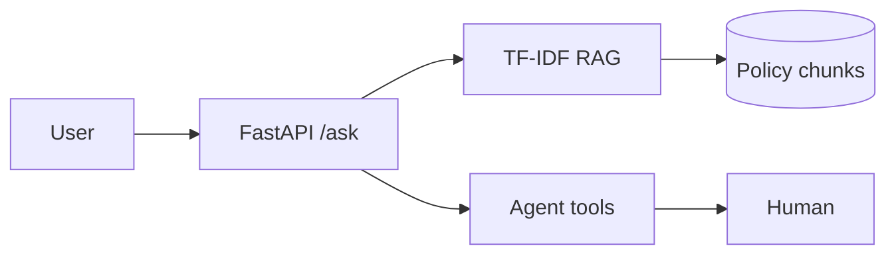

# Banking AI Portfolio

## Technical projects (Track A)

| Project | Metric | Path |
|---------|--------|------|
| credit-pd-model | AUC (see metrics.json) | `lab/projects/credit-pd-model/` |
| policy-rag | Grounded TF-IDF RAG | `lab/projects/policy-rag/` |
| policy-copilot-agent | 3 tools + escalation | `lab/projects/policy-copilot-agent/` |
| week33_fastapi | /health + /ask | `lab/projects/week33_fastapi/` |
| BRD intake app | Quality gate ≥80% | `apps/brd/` |

## Track B — Head of AI artifacts

Fill templates at weeks **8, 16, 28, 40, 52**; mark complete in Learning app → **Leadership** tab.

| ID | Week | Deliverable | Template |
|----|------|-------------|----------|
| H0 | 8 | AI strategy one-pager | `curriculum/templates/hoai/week08_ai_strategy.md` |
| H1 | 16 | PD value case (VND/bps) | `curriculum/templates/hoai/week16_pd_value_case.md` |
| H2 | 28 | Copilot G1/G2/G3 governance | `curriculum/templates/hoai/week28_copilot_governance.md` |
| H3 | 40 | 90-day AI Factory plan | `curriculum/templates/hoai/week40_ninety_day_plan.md` |
| H4 | 52 | Steering deck + narrative | `curriculum/templates/hoai/week52_steering_deck.md` |

**VPBank HoAI variant (Week 52):** `curriculum/templates/hoai/vpbank_steering_one_pager.md` · slides: `exports/learning/Learning-Track-B-Slides.pptx`

**Guide:** `curriculum/head-of-ai-track.md` · **JD map:** `curriculum/job-skills-adaptation.md` §F.4

## Architecture (Mermaid)

## Demo video

- [ ] Record 5-min English walkthrough (technical + 1 min Track B steering hook)
