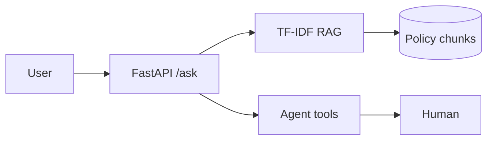

# Banking AI Portfolio

| Project | Metric | Link |
|---------|--------|------|
| credit-pd-model | AUC (see metrics.json) | lab/projects/credit-pd-model/ |
| policy-rag | Grounded TF-IDF RAG | lab/projects/policy-rag/ |
| policy-copilot-agent | 3 tools + escalation | lab/projects/policy-copilot-agent/ |
| week33_fastapi | /health + /ask | lab/projects/week33_fastapi/ |

## Architecture (Mermaid)

## Demo video
- [ ] Record 5-min English walkthrough
