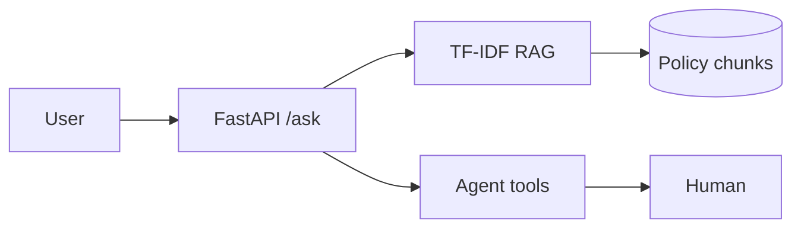

# Banking AI Portfolio

## Technical projects (Track A)

| Project | Metric | Path |
|---------|--------|------|
| credit-pd-model | AUC (see metrics.json) | `lab/projects/credit-pd-model/` |
| policy-rag | Grounded TF-IDF RAG | `lab/projects/policy-rag/` |
| policy-copilot-agent | 3 tools + escalation | `lab/projects/policy-copilot-agent/` |
| week33_fastapi | /health + /ask | `lab/projects/week33_fastapi/` |
| BRD intake app | Quality gate ≥80% | `apps/brd/` |

## Track B — Head of AI artifacts

Fill templates at weeks **8, 16, 28, 40, 52**; save to **`lab/delivery/track-b/`** · mark complete in Learning app → **Leadership** tab.

**Playbook:** [curriculum/track-b-delivery.md](../../curriculum/track-b-delivery.md)

| ID | Week | Deliverable | Save as |
|----|------|-------------|---------|
| H0 | 8 | AI strategy one-pager | `lab/delivery/track-b/h0-ai-strategy.md` |
| H1 | 16 | PD value case (VND/bps) | `lab/delivery/track-b/h1-pd-value-case.md` |
| H2 | 28 | Copilot G1/G2/G3 governance | `lab/delivery/track-b/h2-copilot-governance.md` |
| H3 | 40 | 90-day AI Factory plan | `lab/delivery/track-b/h3-ninety-day-plan.md` |
| H4 | 52 | Steering deck + narrative | `lab/delivery/track-b/h4-steering-deck.md` + `exports/` |

**VPBank HoAI variant (Week 52):** `curriculum/templates/hoai/vpbank_steering_one_pager.md` · slides: `exports/learning/Learning-Track-B-Slides.pptx`

**Guide:** `curriculum/head-of-ai-track.md` · **JD map:** `curriculum/job-skills-adaptation.md` §F.4

## Architecture (Mermaid)

## Demo video

- [ ] Record 5-min English walkthrough (technical + 1 min Track B steering hook)
